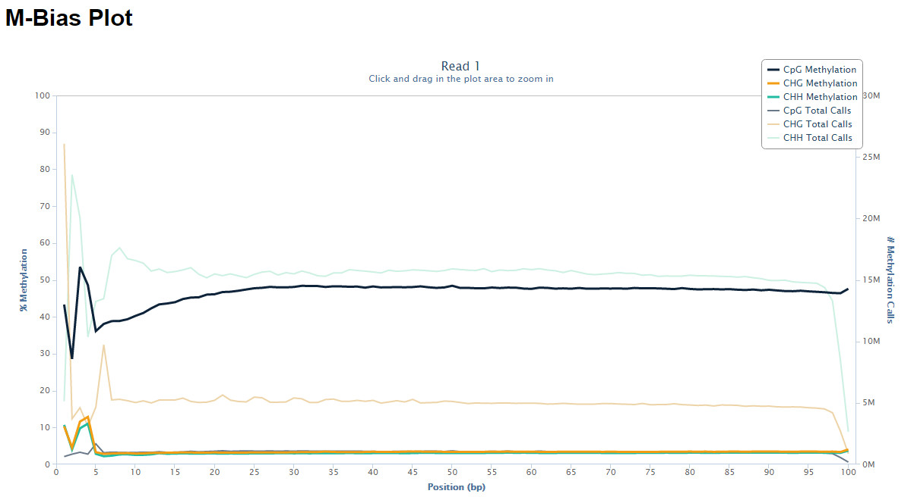

# Bismark Bisulfite Mapper


## User Guide - v0.18.0
#### 15 May, 2017

This User Guide outlines the Bismark suite of tools and gives more details for each individual step. For troubleshooting some of the more commonly experienced problems in sequencing in general and bisulfite-sequencing in particular please browse through the sequencing section at [QCFail.com](https://sequencing.qcfail.com/).

# 1) Quick Reference


Bismark needs a working version of Perl and it is run from the command line. Furthermore, [Bowtie](http://bowtie-bio.sourceforge.net/index.shtml) or [Bowtie 2](http://bowtie-bio.sourceforge.net/bowtie2) needs to be installed on your computer. For more information on how to run Bismark with Bowtie 2 please go to the end of this manual.

As of version 0.14.0 or higher, Bismark may be run using parallelisation for both the alignment and the methylation extraction step. Search for `--multicore` for more details below.

First you need to download a reference genome and place it in a genome folder. Genomes can be obtained e.g. from the [Ensembl](http://www.ensembl.org/info/data/ftp/index.html/) or [NCBI](ftp://ftp.ncbi.nih.gov/genomes/) websites. For the example below you would need to download the _Homo sapiens_ genome. Bismark supports reference genome sequence files in `FastA` format, allowed file extensions are either either `.fa` or `.fasta`. Both single-entry and multiple-entry `FastA` files are supported.

The following examples will use the file `test_dataset.fastq` which is available for download from the Bismark project or Github pages (it contains 10,000 reads in FastQ format, Phred33 qualities, 50 bp long reads, from a human directional BS-Seq library). An example report for use with Bowtie 1 and Bowtie can be found in Appendix IV.

## (I) Running `bismark_genome_preparation`
**USAGE:**
```
bismark_genome_preparation [options] <path_to_genome_folder>
```

A typical genome indexing could look like this:
```
/bismark/bismark_genome_preparation --path_to_bowtie /usr/bin/bowtie2/ --verbose /data/genomes/homo_sapiens/GRCh37/
```

## (II) Running `bismark`
**USAGE:**
```
bismark [options] --genome <genome_folder> {-1 <mates1> -2 <mates2> | <singles>}
```

Typical alignment example (tolerating one non-bisulfite mismatch per read):
```
bismark --bowtie1 -n 1 -l 50 /data/genomes/homo_sapiens/GRCh37/ test_dataset.fastq
```

This will produce two output files:
1. `test_dataset_bismark.bam` (contains all alignments plus methylation call strings)
2. `test_dataset_bismark_SE_report.txt` (contains alignment and methylation summary)

**NOTE:** In order to work properly the current working directory must contain the sequence files to be analysed.


## (III) Running `bismark_methylation_extractor`
**USAGE:**
```
bismark_methylation_extractor [options] <filenames>
```

A typical command to extract context-dependent (CpG/CHG/CHH) methylation could look like this:
```
bismark_methylation_extractor --gzip test_dataset.fastq_bismark.bam
```

This will produce three output files:
    
* `CpG_context_test_dataset_bismark.txt`
* `CHG_context_test_dataset_bismark.txt`
* `CHH_context_test_dataset_bismark.txt`

## (IV) Running `bismark2report`
**USAGE:**
```
bismark2report [options]
```

This command attempts to find Bismark alignment, deduplication and methylation extraction (splitting) reports as well as M-bias files to generate a graphical HTML report such as this [example Bismark paired-end report](http://www.bioinformatics.babraham.ac.uk/projects/bismark/PE_report.html) for each sample in a directory.

## (V) Running `bismark2summary`
**USAGE:**
```
bismark2summary [options]
```

This command scans the current working directory for different Bismark alignment, deduplication and methylation extraction (splitting) reports to produce a graphical summary HTML report, as well as a data table, for all files in a directory. Here is a sample [Bismark Summary Report](http://www.bioinformatics.babraham.ac.uk/projects/bismark/bismark_summary_report.html).


# 2) Bismark - General Information

## What is Bismark?
Bismark is a set of tools for the time-efficient analysis of Bisulfite-Seq (BS-Seq) data. Bismark performs alignments of bisulfite-treated reads to a reference genome and cytosine methylation calls at the same time. Bismark is written in Perl and is run from the command line. Bisulfite-treated reads are mapped using the short read aligner Bowtie 1 (Langmead B, Trapnell C, Pop M, Salzberg SL. Ultrafast and memory-efficient alignment of short DNA sequences to the human genome. Genome Biol 10:R25), or alternatively Bowtie 2, and therefore it is a requirement that Bowtie 1 (or Bowtie 2) are also installed on your machine (see Dependencies).

All files associated with Bismark as well as a test BS-Seq data set can be downloaded from [Babraham Bioinformatics](http://www.bioinformatics.babraham.ac.uk/projects/bismark/) or [Github](https://github.com/FelixKrueger/Bismark).

We would like to hear your comments, suggestions or bugs about Bismark! Please e-mail them to: [felix.krueger@babraham.ac.uk](mailto:felix.krueger@babraham.ac.uk)

## Installation notes
Bismark is written in Perl and is executed from the command line. To install Bismark simply copy the bismark_v0.X.Y.tar.gz file into a Bismark installation folder and extract all files by typing:

```
tar xzf bismark_v0.X.Y.tar.gz
```

## Dependencies
Bismark requires a working of Perl and [Bowtie 1](http://bowtie-bio.sourceforge.net/index.shtml) / [Bowtie 2](http://bowtie-bio.sourceforge.net/bowtie2) to be installed on your machine. Bismark will assume that the Bowtie 1 / Bowtie 2 executable is in your path unless the path to Bowtie is specified manually with:
```
--path_to_bowtie </../../bowtie(1/2)>
```

## Hardware requirements
Bismark holds the reference genome in memory and in addition to that runs up to four parallel instances of Bowtie. The memory usage is dependent on the size of the reference genome. For a large eukaryotic genome (human or mouse) we experienced a typical memory usage of around 12GB. We thus recommend running Bismark on a machine with 5 CPU cores and at least 12 GB of RAM. The memory requirements of Bowtie 2 are somewhat larger (possibly to allow gapped alignments). When running Bismark using Bowtie 2 we therefore recommend a system with at least 5 cores and > 16GB of RAM.

Alignment speed depends largely on the read length and alignment parameters used. Allowing many mismatches and using a short seed length (which is the default option for Bowtie 1, see below) tends to be fairly slow, whereas looking for near perfect matches can align around 5-25 million sequences per hour (using Bowtie 1). Since we haven’t tested Bowtie 2 very much yet we can’t give recommendations about alignment parameters and speed of Bowtie 2 at the current time.

## BS-Seq test data set
A test BS-Seq data set is available for download from the Bismark project or Github pages. It contains 10,000 single- end shotgun BS reads from human ES cells in FastQ format (from SRR020138, Lister et al., 2009; trimmed to 50 bp; base call qualities are Sanger encoded Phred values (Phred33)).

## Which kind of BS-Seq files are supported?
Bismark supports the alignment of bisulfite-treated reads (whole genome shotgun BS-Seq (WGSBS), reduced-representation BS-Seq (RRBS) or PBAT-Seq (Post-Bisulfite Adapter Tagging) for the following conditions:

- sequence format either `FastQ` or `FastA`
- single-end or paired-end reads
- input files can be uncompressed or `gzip`-compressed (ending in `.gz`)
- variable read length support
- directional or non-directional BS-Seq libraries

A full list of alignments modes can be found in [`Bismark_alignment_modes.pdf`](http://www.bioinformatics.babraham.ac.uk/projects/bismark/Bismark_alignment_modes.pdf).

In addition, Bismark retains much of the flexibility of Bowtie 1 / Bowtie 2 (adjustable seed length, number of mismatches, insert size ...). For a full list of options please run:
 
```
bismark --help
```

or see the Appendix at the end of this User Guide.

**NOTE:** It should be mentioned that Bismark supports only reads in base-space, such as from the Illumina platform. There are currently no plans to extend its functionality to colour-space reads.

## How does Bismark work?
Sequence reads are first transformed into fully bisulfite-converted forward (C->T) and reverse read (G->A conversion of the forward strand) versions, before they are aligned to similarly converted versions of the genome (also C->T and G->A converted). Sequence reads that produce a unique best alignment from the four alignment processes against the bisulfite genomes (which are running in parallel) are then compared to the normal genomic sequence and the methylation state of all cytosine positions in the read is inferred. For use with Bowtie 1, a read is considered to align uniquely if one alignment exists that has with fewer mismatches to the genome than any other alignment (or if there is no other alignment). For Bowtie 2, a read is considered to align uniquely if an alignment has a unique best alignment score (as reported by the Bowtie 2 `AS:i` field). If a read produces several alignments with the same number of mismatches or with the same alignment score (`AS:i` field), a read (or a read-pair) is discarded altogether.

## Bismark alignment and methylation call report
Upon completion, Bismark produces a run report containing information about the following:
- Summary of alignment parameters used
- Number of sequences analysed
- Number of sequences with a unique best alignment (mapping efficiency)
- Statistics summarising the bisulfite strand the unique best alignments came from
- Number of cytosines analysed
- Number of methylated and unmethylated cytosines
- Percentage methylation of cytosines in CpG, CHG or CHH context (where H can be either A, T or C). This percentage is calculated individually for each context following the equation:

> % methylation (context) = 100 * methylated Cs (context) / (methylated Cs (context) + unmethylated Cs (context)).

It should be stressed that the percent methylation value (context) is just a very rough calculation performed directly at the mapping step. Actual methylation levels after post-processing or filtering have been applied may vary.

# 3) Running Bismark
Running Bismark is split up into three main steps:

1. First, the genome of interest needs to be bisulfite converted and indexed to allow Bowtie alignments. This step needs to be carried out only once for each genome. Note that Bowtie 1 and Bowtie 2 require distinct indexing steps since their indexes are not compatible.
2. Bismark read alignment step. Simply specify a file to be analysed, a reference genome and alignment parameters. Bismark will produce a combined alignment/methylation call output (default is BAM format) as well as a run statistics report.
3. Bismark methylation extractor. This step is optional and will extract the methylation information from the Bismark alignment output. Running this additional step allows splitting the methylation information up into the different contexts, getting strand-specific methylation information and offers some filtering options. You can also choose to sort the methylation information into `bedGraph`/`coverage` files, or even process them further to genome-wide cytosine methylation reports.

Each of these steps will be described in more detail (with examples) in the following sections.

## (I) Bismark Genome Preparation

This script needs to be run only once to prepare the genome of interest for bisulfite alignments. You need to specify a directory containing the genome you want to align your reads against (please be aware that the `bismark_genome_preparation` script currently expects `FastA` files in this folder (with either `.fa` or `.fasta` extension, single or multiple sequence entries per file). Bismark will create two individual folders within this directory, one for a C->T converted genome and the other one for the G->A converted genome. After creating C->T and G->A versions of the genome they will be indexed in parallel using the indexer `bowtie-build` (or `bowtie2-build`). Once both C->T and G->A genome indices have been created you do not need to use the genome preparation script again (unless you want to align against a different genome...).

Please note that Bowtie 1 and 2 indexes are not compatible. To create a genome index for use with Bowtie 1 the option `--bowtie1` needs to be included as well.

### Running `bismark_genome_preparation`
**USAGE:** `bismark_genome_preparation [options] <path_to_genome_folder>`

A typical command could look like this:

```
bismark_genome_preparation --path_to_bowtie /usr/bin/bowtie2/ --verbose /data/genomes/homo_sapiens/GRCh37/
```

## (II) Bismark Alignment Step

This step represents the actual bisulfite alignment and methylation calling part. Bismark requires the user to specify only two things:

1. The directory containing the genome of interest. This folder must contain the unmodified genome (as `.fa` or `.fasta` files) as well as the two bisulfite genome subdirectories which were generated in the Bismark Genome Preparations step (see above).
2. The sequence file(s) to be analysed (in either `FastQ` or `FastA` format).

All other parameters are optional.

For each sequence file or each set of paired-end sequence files, Bismark produces one alignment and methylation call output file as well as a report file detailing alignment and methylation call statistics for your information and record keeping.

### Running `bismark`

Before running Bismark we recommend spending some time on quality control of the raw sequence files using [FastQC](http://www.bioinformatics.babraham.ac.uk/projects/fastqc/). FastQC might be able to spot irregularities associated with your BS-Seq file, such as high base calling error rates or contaminating sequences such as PCR primers or Illumina adapters. Many sources of error impact detrimentally the alignment efficiencies and/or alignment positions, and thus possibly also affect the methylation calls and conclusions drawn from the experiment.

If no additional options are specified Bismark will use a set of default values, some of which are:

### Using Bowtie 1:
- If no specific path to Bowtie is specified it is assumed that the `bowtie` executable is in the `PATH`
- Bowtie 1 is run `--best` mode (it is possible but not recommended to turn this off)
- Standard alignments allow up to 1 mismatch in the seed region (which is defined as the first 28 bp by default). These parameters can be modified using the options `-n` and `-l`, respectively.

### Using Bowtie 2:
- Using Bowtie 2 is the default mode
- If no specific path to Bowtie 2 is specified it is assumed that the `bowtie2` executable is in the `PATH`
- Standard alignments use a multi-seed length of 20bp with 0 mismatches. These parameters can be modified using the options `-L` and `-N`, respectively
- Standard alignments use the default minimum alignment score function L,0,-0.2, i.e. f(x) = 0 + -0.2 * x (where x is the read length). For a read of 75bp this would mean that a read can have a lowest alignment score of -15 before an alignment would become invalid. This is roughly equal to 2 mismatches or ~2 indels of 1-2 bp in the read (or a combination thereof). The stringency can be set using the `--score_min <func>` function.

Even though the user is not required to specify additional alignment options it is often advisable to do so (e.g. when the default parameters are too strict). To see a full list of options please type `bismark --help` on the command line or see the Appendix at the end of this User Guide.

### Directional BS-Seq libraries (default)
Bisulfite treatment of DNA and subsequent PCR amplification can give rise to four (bisulfite converted) strands for a given locus. Depending on the adapters used, BS-Seq libraries can be constructed in two different ways:

1. If a library is directional, only reads which are (bisulfite converted) versions of the original top strand (OT) or the original bottom strand (OB) will be sequenced. Even though the strands complementary to OT (CTOT) and OB (CTOB) are generated in the BS-PCR step they will not be sequenced as they carry the wrong kind of adapter at their 5’-end. By default, Bismark performs only 2 read alignments to the OT and OB strands, thereby ignoring alignments coming from the complementary strands as they should theoretically not be present in the BS-Seq library in question.
2. Alternatively, BS-Seq libraries can be constructed so that all four different strands generated in the BS-PCR can and will end up in the sequencing library with roughly the same likelihood. In this case all four strands (OT, CTOT, OB, CTOB) can produce valid alignments and the library is called non- directional. Specifying `--non_directional` instructs Bismark to use all four alignment outputs.

To summarise again: alignments to the original top strand or to the strand complementary to the original top strand (OT and CTOT) will both yield methylation information for cytosines on the top strand. Alignments to the original bottom strand or to the strand complementary to the original bottom strand (OB and CTOB) will both yield methylation information for cytosines on the bottom strand, i.e. they will appear to yield methylation information for G positions on the top strand of the reference genome.

For more information about how to extract methylation information of the four different alignment strands please see below in the section on the Bismark methylation extractor.

**USAGE:**
```
bismark [options] --genome <genome_folder> {-1 <mates1> -2 <mates2> | <singles>}
```

A typical single-end analysis could look like this:

```
bismark --genome /data/genomes/homo_sapiens/GRCh37/ sample.fastq.gz
```

### What does the Bismark output look like?
Since version 0.6.x the default output of Bismark is in BAM/SAM format when using either Bowtie 1 or Bowtie 2. The former custom Bismark output for Bowtie 1, which used to be the standard output up to versions 0.5.x, is still available by specifying the option `--vanilla` (see below) but is likely going to be dropped entirely in a future release. The Bismark output using Bowtie 2 is invariably in BAM/SAM format (which is required to encode gapped alignments).

### Bismark BAM/SAM output (default)
By default, Bismark generates SAM output for all alignment modes. Please note that reported quality values are encoded in Sanger format (Phred 33 scale), even if the input was in Phred64 or the old Solexa format.

1. `QNAME` (seq-ID)
2. `FLAG` (this flag tries to take the strand a bisulfite read originated from into account (this is different from ordinary DNA alignment flags!))
3. `RNAME` (chromosome)
4. `POS` (start position)
5. `MAPQ` (only calculated for Bowtie 2, always 255 for Bowtie)
6. `CIGAR`
7. `RNEXT`
8. `PNEXT`
9. `TLEN`
10. `SEQ`
11. `QUAL` (Phred33 scale)
12. `NM-tag` (edit distance to the reference)
13. `MD-tag` (base-by-base mismatches to the reference) (14) XM-tag (methylation call string)
15. `XR-tag` (read conversion state for the alignment) (16) XG-tag (genome conversion state for the alignment)

The mate read of paired-end alignments is written out as an additional separate line in the same format.

### Custom (‘vanilla’) Bismark output (Bowtie 1 only)
Bismark can generate a comprehensive alignment and methylation call output file for each input file or set of paired-end input files. The sequence basecall qualities of the input FastQ files are written out into the Bismark output file as well to allow filtering on quality thresholds. Please note that the quality values are encoded in Sanger format (Phred 33 scale), even if the input was in Phred64 or the old Solexa format.

### The single-end output contains the following information (1 line per sequence, tab delimited):

1. seq-ID
2. alignment strand
3. chromosome
4. start
5. end
6. original bisulfite read sequence
7. equivalent genomic sequence (+2 extra bp) (8) methylation call string
9. read conversion
10. genome conversion
11. read quality score (Phred33 scale)

### Single-end alignment example:

1. `HWUSI-EAS611_0001:3:1:1186:18334#0/1`
2. `+`
3. `4`
4. `122893213`
5. `122893242`
6. `TGGGTTTTTAAGATTTTGTGTAGTTGGGGTTTGGAGATGG`
7. `CGGGCCCTCAAGACCCTGCGCAGCTGGGGCCTGGAGACGGAG`
8. `z...hhh.h....hhx..z.x..x.....hx......z..`
9. `CT`
10. `CT`
11. `IIIIIIIIIIIIIIIIIIIIIIIIIIIIIIIIIIIIIIII`

### The paired-end output looks like this (1 line per sequence pair, tab separated):

1. seq-ID
2. alignment strand
3. chromosome
4. start
5. end
6. original bisulfite read sequence 1
7. equivalent genomic sequence 1 (+2 extra bp) (8) methylation call string 1
9. original bisulfite read sequence 2
10. equivalent genomic sequence 2 (+2 extra bp) (11) methylation call string 2
12. read 1 conversion
13. genome conversion
14. read 1 quality score (Phred33 scale)
15. read 2 quality score (Phred33 scale)

### Paired-end alignment example

1. `HWUSI-EAS611_100205:2:1:13:1732#0`
2. `+`
3. `14`
4. `62880539`
5. `62880652`
6. `CGGGATTTCGCGGAGTACGGGTGATCGTGTGGAATATAGA`
7. `CGGGACTCCGCGGAGCACGGGTGACCGTGTGGAATACAGAGT`
8. `Z....h.xZ.Z....h.Z......xZ..........x...`
9. `CAACTATCTAAAACTAAAAATAACGCCGCCCAAAAACTCT`
10. `TCCGGCTGTCTGGAGCTGAAGATGGCGCCGCCCAGAAGCTCT`
11. `.zx..x...xh.h..x..h..hh.Z..Z....x..h....`
12. `CT`
13. `CT`
14. `IIIIIIIIIIIIIIIIIIIIIIIIIIIIIIIIIIIIIIII`
15. `IIIIIIIIIIIIIIIIIIIIIIIIIIIIIIIIIIIIIIII`

### Data visualisation

To see the location of the mapped reads the Bismark output file can be imported into a genome viewer, such as SeqMonk, using the chromosome, start and end positions (this can be useful to identify regions in the genome which display an artefactually high number of aligned reads). The alignment output can also be used to apply post-processing steps such as de-duplication (allowing only 1 read for each position in the genome to remove PCR artefacts) or filtering on the number of bisulfite conversion related non-bisulfite mismatches * (please note that such post-processing scripts are not part of the Bismark package).

> \* Bisulfite conversion related non-bisulfite mismatches are mismatch positions which have a C in the BS-read but a T in the genome; such mismatches may occur due to the way bisulfite read alignments are performed. Reads containing this kind of mismatches are not automatically removed from the alignment output in order not to introduce a bias for methylated reads. It should be noted that, even though no methylation calls are performed for these positions, reads containing bisulfite conversion related non-bisulfite mismatches might lead to false alignments if particularly lax alignment parameters were specified.

### Methylation call

The methylation call string contains a dot `.` for every position in the BS-read not involving a cytosine, or contains one of the following letters for the three different cytosine methylation contexts (UPPER CASE = METHYLATED, lower case = unmethylated):

- `z` -  C in CpG context - unmethylated
- `Z` -  C in CpG context - methylated
- `x` -  C in CHG context - unmethylated
- `X` -  C in CHG context - methylated
- `h` - C in CHH context - unmethylated
- `H` -  C in CHH context - methylated
- `u` - C in Unknown context (CN or CHN) - unmethylated
- `U` - C in Unknown context (CN or CHN) - methylated
- `.` - not a C or irrelevant position

## (III) Bismark methylation extractor

Bismark comes with a supplementary `bismark_methylation_extractor` script which operates on Bismark result files and extracts the methylation call for every single C analysed. The position of every single C will be written out to a new output file, depending on its context (CpG, CHG or CHH), whereby methylated Cs will be labelled as forward reads (+), non-methylated Cs as reverse reads (-). The resulting files can be imported into a genome viewer such as SeqMonk (using the generic text import filter) and the analysis of methylation data can commence. Alternatively, the output of the methylation extractor can be transformed into a `bedGraph` and `coverage` file using the option `--bedGraph` (see also `--counts`). This step can also be accomplished from the methylation extractor output using the stand-alone script `bismark2bedGraph` (also part of the Bismark package available for download at [bioinformatics.babraham.ac.uk](http://www.bioinformatics.babraham.ac.uk/projects/bismark/)). The `coverage` file can also be imported into SeqMonk directly using `Import Data > Bismark (cov)`. Optionally, the bedGraph counts output can be used to generate a genome-wide cytosine report which reports the number on every single CpG (optionally every single cytosine) in the genome, irrespective of whether it was covered by any reads or not. As this type of report is informative for cytosines on both strands the output may be fairly large (~46mn CpG positions or >1.2bn total cytosine positions in the human genome...). The bedGraph to genome-wide cytosine report conversion can also be run individually using the stand- alone module `coverage2cytosine` (also part of the Bismark package available for download at [bioinformatics.babraham.ac.uk](http://www.bioinformatics.babraham.ac.uk/projects/bismark/)).

As of Bismark version 0.6 or higher the default input format for the `bismark_methylation_extractor` is BAM/SAM (or potentially CRAM if you’ve got Samtools 1.2+ installed). The former custom Bismark format can still be used by specifying `--vanilla` (for the time being).

### The methylation extractor output looks like this (tab separated):

    1. seq-ID
    2. methylation state
    3. chromosome
    4. start position (= end position)
    5. methylation call

Methylated cytosines receive a `+` orientation, unmethylated cytosines receive a `-` orientation.

Examples for cytosines in CpG context:

    HWUSI-EAS611_0006:3:1:1058:15806#0/1 - 6 91793279 z
    HWUSI-EAS611_0006:3:1:1058:17564#0/1 + 8 122855484 Z
    
Examples for cytosines in CHG context:

    HWUSI-EAS611_0006:3:1:1054:1405#0/1 - 7 89920171 x
    HWUSI-EAS611_0006:3:1:1054:1405#0/1 + 7 89920172 X
    
Examples for cytosines in CHH context:

    HWUSI-EAS611_0006:3:1:1054:1405#0/1 - 7 89920184 h
    

The `bismark_methylation_extractor` comes with a few options, such as ignoring the first <int> number of positions in the methylation call string, e.g. to remove a restriction enzyme site (if RRBS is performed with non-directional BS-Seq libraries it might be required to remove reconstituted MspI sites at the beginning of each read as they will introduce a bias into the first methylation call). Another useful option for paired-end reads is called `--no_overlap` (on by default): specifying this option will extract the methylation calls of overlapping parts in the middle of paired-end reads only once (using the calls from the first read which is presumably the one with a lowest error rate).

For a full list of options type: `bismark_methylation_extractor --help` on the command line or refer to the Appendix section at the end of this User Guide.

### Methylation extractor output

By default, the `bismark_methylation_extractor` discriminates between cytosines in CpG, CHG or CHH context. If desired, CHG and CHH contexts can be merged into a single non-CpG context by specifying the option `--merge_non_CpG` (as a word of warning, this might produce files with up to several hundred million lines...).

### Strand-specific methylation output files (default):

As its default option, the `bismark_methylation_extractor` will produce a strand-specific output which will use the following abbreviations in the output file name to indicate the strand the alignment came from:

    OT    –  original top strand
    CTOT  –  complementary to original top strand
    OB    –  original bottom strand
    CTOB  –  complementary to original bottom strand
    
Methylation calls from OT and CTOT will be informative for cytosine methylation positions on the original top strand, calls from OB and CTOB will be informative for cytosine methylation positions on the original bottom strand. Please note that specifying the `--directional` (the default mode) option in the Bismark alignment step will not report any alignments to the CTOT or CTOB strands.

As cytosines can exist in any of three different sequence contexts (CpG, CHG or CHH) the `bismark_methylation_extractor` default output will consist of 12 individual output files per input file (`CpG_OT_...`, `CpG_CTOT_...`, `CpG_OB_...` etc.).

### Context-dependent methylation output files (`--comprehensive` option):

If strand-specific methylation is not of interest, all available methylation information can be pooled into a single context-dependent file (information from any of the four strands will be pooled). This will default to three output files (CpG-context, CHG-context and CHH-context), or result in 2 output files (CpG-context and Non-CpG-context) if `--merge_non_CpG` was selected (note that this can result in enormous file sizes for the non-CpG output).

Both strand-specific and context-dependent options can be combined with the `--merge_non_CpG` option.

### Optional bedGraph output
The Bismark methylation extractor can optionally also output a file in [`bedGraph`](http://genome.ucsc.edu/goldenPath/help/bedgraph.html) format which uses 0-based genomic start and 1- based end coordinates. The module `bismark2bedGraph` (part of the Bismark package) may also be run individually. It will be sorted by chromosomal coordinates and looks like this:
```
<chromosome> <start position> <end position> <methylation percentage>
```

As the methylation percentage is _per se_ not informative of the actual read coverage of detected methylated or unmethylated reads at a position, `bismark2bedGraph` also writes out a coverage file (using 1-based genomic genomic coordinates) that features two additional columns:
```
<chromosome> <start position> <end position> <methylation percentage> <count methylated> <count unmethylated>
```

These two additional columns enable basically any downstream processing from the file. By default, this mode will only consider cytosines in CpG context, but it can be extended to cytosines in any sequence context by using the option `--CX` (cf. Appendix (III)).

### Optional genome-wide cytosine report output
Starting from the `coverage` output, the Bismark methylation extractor can optionally also output a genome-wide cytosine methylation report. The module `coverage2cytosine` (part of the Bismark package) may also be run individually. It is also sorted by chromosomal coordinates but also contains the sequence context and is in the following format:
```
<chromosome> <position> <strand> <count methylated> <count unmethylated> <C-context> <trinucleotide context>
```

The main difference to the `bedGraph` or `coverage` output is that **every** cytosine on both the top and bottom strands will be considered irrespective of whether they were actually covered by any reads in the experiment or not. For this to work one has to also specify the genome that was used for the `Bismark` alignments using the option `--genome_folder <path>`. As for the `bedGraph` mode, this will only consider cytosines in CpG context by default but can be extended to cytosines in any sequence context by using the option `--CX` (cf. Appendix (III)). Be aware though that this might mean an output with individual lines for more than 1.1 billion cytosines for any large mammalian genome...

### M-bias plot
Starting with Bismark v0.8.0, the Bismark methylation extractor also produces a methylation bias plot which shows the methylation proportion across each possible position in the read (described in further detail in: [Hansen et al., Genome Biology, 2012, 13:R83](https://genomebiology.biomedcentral.com/articles/10.1186/gb-2012-13-10-r83)). The data for the M-bias plot is also written into a coverage text file (ending in `.cov` or `.cov.gz`) and is in the following format:

```
<read position> <count methylated> <count unmethylated> <% methylation> <total coverage>
```

This allows generating nice graphs by alternative means, e.g. using R or Excel. The plot is also drawn into a .png file which requires the Perl module GD::Graph (more specifically, both modules GD::Graph::lines and GD::Graph::colour are required); if GD::Graph cannot be found on the system, only the table will be printed. The plot also contains the absolute number of methylation calls (both methylated and unmethylated) per position. For paired-end reads two individual M-bias plots will be drawn.

The M-bias plot can for example show the methylation bias at the start of reads in PBAT-Seq experiments:



For more on this topic please also see [this post on QCFail.com](https://sequencing.qcfail.com/articles/mispriming-in-pbat-libraries-causes-methylation-bias-and-poor-mapping-efficiencies/).

Or it can reveal a 3’-end-repair bias at the first couple of positions in read 2 of paired-end reads, like here:


For more on this topic please also see [this post on QCFail.com](https://sequencing.qcfail.com/articles/library-end-repair-reaction-introduces-methylation-biases-in-paired-end-pe-bisulfite-seq-applications/).

The M-bias plot should enable researchers to make an informed decision whether or not to leave the bias in the final data or to remove it (e.g. using the methylation extractor option `--ignore`).

### (III) Running `bismark_methylation_extractor`
**USAGE:** `bismark_methylation_extractor [options] <filenames>`

A typical command for a single-end file could look like this: 

```
bismark_methylation_extractor -s --gzip sample_bismark_bt2.bam
```

A typical command for a paired-end file could look like this:

```
bismark_methylation_extractor -p --gzip sample_bismark_bt2_pe.bam
```

The methylation extractor can also auto-detect the alignment mode and will set the options above automatically. A typical command including the optional `bedGraph` output could look like this:

```
bismark_methylation_extractor --gzip --bedGraph --buffer_size 10G sample_bismark_bt2.bam
```

A typical command including the optional genome-wide cytosine methylation report could look like this:

```
bismark_methylation_extractor --gzip --bedGraph --buffer_size 10G --cytosine_report --genome_folder /path_to_genome_folder/ sample_bismark_bt2.bam
```

## (IV) The Bismark HTML Processing Report

The script `bismark2report` uses a Bismark alignment report, and optionally further reports of the Bismark suite such as deduplication, methylation extractor (splitting) or M-bias reports to generate a graphical HTML report page. If several Bismark reports are found in the same folder, a separate report will be generated for each of these, whereby the output filename is derived from the Bismark alignment report file. `bismark2report` attempts to find optional reports automatically based on the file basename. Here are an example [single-end report](http://www.bioinformatics.babraham.ac.uk/projects/bismark/SE_report.html) and [paired-end report](http://www.bioinformatics.babraham.ac.uk/projects/bismark/PE_report.html).


**USAGE:**
```
bismark2report [options]
```

#### OPTIONS 

- `-o/--output <filename>`

 Name of the output file (optional). If not specified explicitly, the output filename will be derived                           from the Bismark alignment report file. Specifying an output filename only works if the HTML report is                            to be generated for a single Bismark alignment report (and potentially additional reports).

- `--dir <directory>`

Output directory. Output is written to the current directory if not specified explicitly.


- `--alignment_report FILE`

If not specified explicitly, `bismark2report` attempts to find Bismark report file(s) in the current directory and produces a separate HTML report for each mapping report file. Based on the basename of the Bismark mapping report, `bismark2report` will also attempt to find the other Bismark reports (see below) for inclusion into the HTML report. Specifying a Bismark alignment report file is mandatory.

- `--dedup_report FILE`

If not specified explicitly, `bismark2report` attempts to find a deduplication report file with the same                            basename as the Bismark mapping report (generated by `deduplicate_bismark`) in the current working directory. Including a deduplication report is optional, and using the FILE *'none'* will skip this step entirely.

- `--splitting_report FILE`

 If not specified explicitly, `bismark2report` attempts to find a splitting report file with the same basename as the Bismark mapping report (generated by the Bismark methylation extractor) in the current working directory. Including a splitting report is optional, and using the FILE *'none'* will skip this step entirely.

- `--mbias_report FILE`

If not specified explicitly, `bismark2report` attempts to find a single M-bias report file with the same basename as the Bismark mapping report (generated by the Bismark methylation extractor) in the current working directory. Including an M-Bias report is optional, and using the FILE *'none'* will skip this step entirely.

- `--nucleotide_report FILE`

If not specified explicitly, `bismark2report` attempts to find a single nucleotide coverage report file with the same basename as the Bismark mapping report (generated by Bismark with the option `--nucleotide_coverage`, or `bam2nuc` directly) in the current working directory. Including a nucleotide coverage statistics                            report is optional, and using the FILE *'none'* will skip this report entirely.


## (V) The Bismark Summary Report

This script uses Bismark report files of several (up to hundreds of!?) samples in a run folder to generate a graphical summary HTML report as well as a whopping big table (tab-delimited text) with all relevant alignment and methylation statistics which may be used for graphing purposes in R, Excel or the like. Unless certain BAM files are specified, `bismark2summary` first identifies Bismark BAM files in a folder (they need to use the Bismark naming conventions) and then automatically detects Bismark alignment, deduplication or methylation extractor (splitting) reports based on the input file basename. If splitting reports are found they overwrite the methylation statistics of the initial alignment report.


**USAGE:**
```
bismark2summary [options]
```

This command scans the current working directory for different Bismark alignment, deduplication and methylation extraction (splitting) reports to produce a graphical summary HTML report, as well as a data table, for all files in a directory. Here is a sample [Bismark Summary Report](http://www.bioinformatics.babraham.ac.uk/projects/bismark/bismark_summary_report.html).

#### ARGUMENTS:

- BAM file(s)

  Optional. If no BAM files are specified explicitly the current working directory is scanned for Bismark alignment files and their associated reports.

#### OPTIONS:

- `-o/--basename <filename>`

Basename of the output file (optional). Generate a text file with all relevant extracted values '_basename_.txt') as well as an HTML report ('*basename*.html'). If not specified explicitly, the basename is '_bismark\_summary\_report_'.

- `--title <string>`

Optional HTML report title; use `--title "speech marks for text with spaces"`. Default: '*Bismark Summary Report*'.


- `--version`
 
Displays version information and exits.

- `--help`                      

Displays this help message and exits.


## (VI) Bismark Nucleotide Coverage report (`bam2nuc`)

The script `bam2nuc` reads BAM files and calculates the mono- and di-nucleotide coverage of the
reads (using the genomic sequence rather than the observed sequence in the reads themselves)
and compares it to the average genomic sequence composition. Reads harbouring InDels are not
taken into consideration. Mono- or dinucleotides containing Ns are ignored as well.

`bam2nuc` handles both Bismark single-end and paired-end files (determined automatically). Both BAM and CRAM files should work as input, but please note that Samtools version 1.2 or higher is required for CRAM files.


**USAGE:**
```
bam2nuc [options] --genome_folder <path> [input.(bam|cram)]
```


- `--dir`

Output directory. Output is written to the current directory if not specified explicitly.

- `--genome_folder <path>`

Enter the genome folder you wish to use to extract sequences from (full path only). Accepted formats are FastA files ending with '.fa' or '.fasta'. Specifying a genome folder path is mandatory.

- `--samtools_path`

The path to your Samtools installation, e.g. /home/user/samtools/. Does not need to be specified explicitly if Samtools is in the `PATH` already

- `--genomic_composition_only`

Only calculate and extract the genomic sequence composition and exit thereafter. This option will attempt to write the genomic composition table 'genomic\_nucleotide\_frequencies.txt' to the genome folder or to the output directory instead if that doesn't succeed.

- `--help`

Displays this help message and exits

**GENOMIC COMPOSITION**

Since the calculation of the average genomic (di-)nucleotide composition may take a while, `bam2nuc` attempts to write out a file called 'genomic\_nucleotide\_frequencies.txt' to the genome folder if it wasn't there already. The next time `bam2nuc` is run it will then use this file instead of calculating the average genome composition again. If writing to the genome folder fails (e.g. because of permission issues) it will be written out to the output directory instead.


**OUTPUT FORMAT**


`bam2nuc` writes out a file ending in _.nucleotide\_stats.txt_ in the following format (tab-delimited):

    (di-)nucleotide count sample    percent sample  count genomic   percent genomic coverage
    A       14541   30.91   3768086 30.98   0.004
    C       8893    18.90   2321832 19.09   0.004
    G       9019    19.17   2318192 19.06   0.004
    T       14597   31.02   3754886 30.87   0.004
    AA      5008    10.86   1321485 10.86   0.004
    AC      2355    5.11    639783  5.26    0.004
    AG      2692    5.84    709163  5.83    0.004
    AT      4191    9.09    1097652 9.02    0.004
    CA      2912    6.32    786744  6.47    0.004
    CC      1812    3.93    473900  3.90    0.004
    CG      1341    2.91    355535  2.92    0.004
    CT      2659    5.77    705653  5.80    0.004
    GA      2903    6.30    756411  6.22    0.004
    GC      1724    3.74    453607  3.73    0.004
    GG      1817    3.94    470732  3.87    0.004
    GT      2402    5.21    637436  5.24    0.004
    TA      3419    7.42    903441  7.43    0.004
    TC      2823    6.12    754531  6.20    0.004
    TG      2996    6.50    782761  6.44    0.004
    TT      5055    10.96   1314144 10.80   0.004


This file is picked up and plotted by `bismark2report` automatically if found in the folder in the following manner:


## (VII) Filtering out non-bisulfite converted reads (`filter_non_conversion`)

Filtering incomplete bisulfite conversion from Bismark BAM files (optional). This script examines the methylation calls of reads, or read pairs for paired-end sequencing, and filters out reads that exceed a certain threshold of methylated calls in non-CG context (the default is 3). `filter_non_conversion` looks for a certain number of methylated non-CG calls, but this could potentially also be extended to a percentage for any given read.

**Please Note**: Be aware that this kind of filtering is not advisable - and *will* introduce biases - if you work with organisms which exhibit any appreciable levels of non-CG methylation (e.g. most plants).

Writes out a file called _nonCG\_filtered.bam_, also a file called _nonCG\_removed\_seqs.bam_ as well as a short report how many sequences have been analysed and removed.


**USAGE:**

```
filter_non_conversion [options] [Bismark BAM files]
```

**Please also note** that for paired-end BAM files `filter_non_conversion` expects Read 1 and Read 2 to follow each other in consecutive lines! If the file has been sorted by position make sure that you resort it by read name first (e.g. using `samtools sort -n`)


- `-s/--single`

Deduplicate single-end Bismark BAM files. If not specified the library type is auto-detected.

- `-p/--paired`

Deduplicate paired-end Bismark BAM files. If not specified the library type is auto-detected.

- `--threshold [int]`

The number of methylated cytosines in non-CG context at which reads or read pairs are filtered out. For paired-end files either Read 1 or Read 2 can fail the entire read pair. Default: 3.

- `--samtools_path`

The path to your Samtools installation, e.g. /home/user/samtools/. Does not need to be specified explicitly if Samtools is in the PATH already.


- `--help`

Displays this help text end exits.

- `--version`

Displays version information and exits.


If you get stuck at any point or have any questions or comments please contact me via e-mail: [felix.krueger@babraham.ac.uk](felix.krueger@babraham.ac.uk)


## (VIII) Notes about different library types and commercial kits

Here is a table summarising general recommendations for different library types and/or different commercially available kits. Some more specific notes can be found below.

<table>
    <thead>
        <tr>
            <th align="left">Technique</th>
            <th align="center">5' Trimming</th>
            <th align="center">3' Trimming</th>
            <th align="center">Mapping</th>
            <th align="center">Deduplication</th>
            <th align="center">Extraction</th>
    </tr>
    </thead>
    <tbody>
        <tr>
            <td align="left">BS-Seq</td>
            <td align="center"><g-emoji alias="white_large_square" fallback-src="https://assets-cdn.github.com/images/icons/emoji/unicode/2b1c.png" ios-version="6.0">⬜️</g-emoji></td>
            <td align="center"><g-emoji alias="white_large_square" fallback-src="https://assets-cdn.github.com/images/icons/emoji/unicode/2b1c.png" ios-version="6.0">⬜️</g-emoji></td>
            <td align="center"><g-emoji alias="white_large_square" fallback-src="https://assets-cdn.github.com/images/icons/emoji/unicode/2b1c.png" ios-version="6.0">⬜️</g-emoji></td>
            <td align="center"><g-emoji alias="white_check_mark" fallback-src="https://assets-cdn.github.com/images/icons/emoji/unicode/2705.png" ios-version="6.0">✅</g-emoji></td>
            <td align="center"><code>--ignore_r2 2</code></td>
        </tr>
        <tr>
            <td align="left">RRBS</td>
            <td align="center"><code>--rrbs</code> (R2 only)</td>
            <td align="center"><code>--rrbs</code> (R1 only)</td>
            <td align="center"><g-emoji alias="white_large_square" fallback-src="https://assets-cdn.github.com/images/icons/emoji/unicode/2b1c.png" ios-version="6.0">⬜️</g-emoji></td>
            <td align="center"><g-emoji alias="x" fallback-src="https://assets-cdn.github.com/images/icons/emoji/unicode/274c.png" ios-version="6.0">❌</g-emoji></td>
            <td align="center">(<code>--ignore_r2 2</code>)</td>
        </tr>
        <tr>
            <td align="left">RRBS (NuGEN Ovation)</td>
            <td align="center">special processing</td>
            <td align="center">special processing</td>
            <td align="center"><g-emoji alias="white_large_square" fallback-src="https://assets-cdn.github.com/images/icons/emoji/unicode/2b1c.png" ios-version="6.0">⬜️</g-emoji></td>
            <td align="center"><g-emoji alias="x" fallback-src="https://assets-cdn.github.com/images/icons/emoji/unicode/274c.png" ios-version="6.0">❌</g-emoji></td>
            <td align="center"><code>--ignore_r2 2</code></td>
        </tr>
        <tr>
            <td align="left">PBAT</td>
            <td align="center">6N / 9N</td>
            <td align="center">(6N / 9N)</td>
            <td align="center"><code>--pbat</code></td>
            <td align="center"><g-emoji alias="white_check_mark" fallback-src="https://assets-cdn.github.com/images/icons/emoji/unicode/2705.png" ios-version="6.0">✅</g-emoji></td>
            <td align="center"><g-emoji alias="white_large_square" fallback-src="https://assets-cdn.github.com/images/icons/emoji/unicode/2b1c.png" ios-version="6.0">⬜️</g-emoji></td>
        </tr>
        <tr>
            <td align="left">single-cell (scBS-Seq)</td>
            <td align="center">6N</td>
            <td align="center">(6N)</td>
            <td align="center"><code>--non_directional</code>; single-end mode</td>
            <td align="center"><g-emoji alias="white_check_mark" fallback-src="https://assets-cdn.github.com/images/icons/emoji/unicode/2705.png" ios-version="6.0">✅</g-emoji></td>
            <td align="center"><g-emoji alias="white_large_square" fallback-src="https://assets-cdn.github.com/images/icons/emoji/unicode/2b1c.png" ios-version="6.0">⬜️</g-emoji></td>
        </tr>
        <tr>
            <td align="left">TruSeq (EpiGnome)</td>
            <td align="center">8 bp</td>
            <td align="center">(8 bp)</td>
            <td align="center"><g-emoji alias="white_large_square" fallback-src="https://assets-cdn.github.com/images/icons/emoji/unicode/2b1c.png" ios-version="6.0">⬜️</g-emoji></td>
            <td align="center"><g-emoji alias="white_check_mark" fallback-src="https://assets-cdn.github.com/images/icons/emoji/unicode/2705.png" ios-version="6.0">✅</g-emoji></td>
            <td align="center"><g-emoji alias="white_large_square" fallback-src="https://assets-cdn.github.com/images/icons/emoji/unicode/2b1c.png" ios-version="6.0">⬜️</g-emoji></td>
        </tr>
        <tr>
            <td align="left">Accel-NGS (Swift)</td>
            <td align="center">10 bp</td>
            <td align="center">(10 bp)</td>
            <td align="center"><g-emoji alias="white_large_square" fallback-src="https://assets-cdn.github.com/images/icons/emoji/unicode/2b1c.png" ios-version="6.0">⬜️</g-emoji></td>
            <td align="center"><g-emoji alias="white_check_mark" fallback-src="https://assets-cdn.github.com/images/icons/emoji/unicode/2705.png" ios-version="6.0">✅</g-emoji></td>
            <td align="center"><g-emoji alias="white_large_square" fallback-src="https://assets-cdn.github.com/images/icons/emoji/unicode/2b1c.png" ios-version="6.0">⬜️</g-emoji></td>
        </tr>
        <tr>
            <td align="left">Zymo    Pico-Methyl</td>
            <td align="center">10 bp</td>
            <td align="center">(10 bp)</td>
            <td align="center"><code>--non_directional</code></td>
            <td align="center"><g-emoji alias="white_check_mark" fallback-src="https://assets-cdn.github.com/images/icons/emoji/unicode/2705.png" ios-version="6.0">✅</g-emoji></td>
            <td align="center"><g-emoji alias="white_large_square" fallback-src="https://assets-cdn.github.com/images/icons/emoji/unicode/2b1c.png" ios-version="6.0">⬜️</g-emoji></td>
        </tr>
    </tbody>
</table>

* <g-emoji alias="white_large_square" fallback-src="https://assets-cdn.github.com/images/icons/emoji/unicode/2b1c.png" ios-version="6.0">⬜️</g-emoji> -
  Default settings (nothing in particular is required, just use Trim Galore or Bismark default parameters)
* <g-emoji alias="white_check_mark" fallback-src="https://assets-cdn.github.com/images/icons/emoji/unicode/2705.png" ios-version="6.0">✅</g-emoji> -
  Yes, please!
* <g-emoji alias="x" fallback-src="https://assets-cdn.github.com/images/icons/emoji/unicode/274c.png" ios-version="6.0">❌</g-emoji> -
  No, absolutely not!

**5' Trimming** can be accomplished with Trim Galore using: 

`--clip_r1 <NUMBER>` (Read 1) or 

`--clip_r2 <NUMBER>` (Read 2)

**3' Trimming** can be accomplished with Trim Galore using:

`--three_prime_clip_r1 <NUMBER>` (Read 1) or 

`--three_prime_clip_r2 <NUMBER>` (Read 2).


#### SPECIFIC LIBRARY/KIT NOTES

#### RRBS

RRBS is a specialised technique to only look at CpG rich regions of the genome by using the restriction enzyme MspI (please see this [RRBS Guide](http://www.bioinformatics.babraham.ac.uk/projects/bismark/RRBS_Guide.pdf) for some more specifics regarding data processing). For reasons explained in the RRBS-guide, the second last position of all reads before reading into the Illumina adapter exhibits an artificially (not methylated) methylation state as a result of the end-repair reaction. The option `--rrbs` within Trim Galore removes 2 extra bases whenever adapter contamination has been detected. This 3' end trimming that needs to be carried out for single-end runs or Read 1 of paired-end libraries. Read 2 of paired-end libraries is however not affected by this 3' bias, but instead the first couple of positions on the 5' end of Read 2 suffer from the read-through problem as Read 1 (Read 2 is a mere copy of Read 1), so Read 2 needs to have the **first** 2 bp removed instead. As of the current development version of [Trim Galore](https://github.com/FelixKrueger/TrimGalore) (v0.4.2_dev; 12/16/2016) the option `--rrbs` removes:
- 2 bp from the 3' end of single-end and Read 1 of paired-end reads in addition to adapter contamination, and
- 2 bp from the 5' end of Read 2 of paired-end reads


#### RRBS NuGEN Ovation Methyl-Seq System 
([Manufacturer's page](http://www.nugen.com/products/ovation-rrbs-methyl-seq-system))

Owing to the fact that the NuGEN Ovation kit attaches a varying number of nucleotides (0-3) after each MspI site Trim Galore should be run *WITHOUT* the option `--rrbs`. The trimming is accomplished in a subsequent diversity trimming step afterwards, please see the manufacturer's manual for more details.


#### PBAT

The amount of bases that need to be trimmed from the 5' end depends on the length of the oligo used for random priming, which - as we know - isn't all that random, and in fact causes [misalignments and methylation biases](https://sequencing.qcfail.com/articles/mispriming-in-pbat-libraries-causes-methylation-bias-and-poor-mapping-efficiencies/). While the original PBAT paper used 4N oligoes, these days 6N or 9N seem to be most common. Please also see the section _3' Trimming in general_ below.

#### Single-cell

The [scBS-Seq method](http://www.nature.com/nmeth/journal/v11/n8/full/nmeth.3035.html) uses a PBAT-type protocol but employs five rounds of sequence capture and elongation to amplify the starting material so all four different bisulfite strands (OT, CTOT, OB, CTOB) are sequenced. Since 6N oligos are used to for the random priming step, 6 bp need to be removed from the 5' ends. Since scBS and PBAT libraries tend to result in [chimaeric fragments](https://sequencing.qcfail.com/articles/pbat-libraries-may-generate-chimaeric-read-pairs/) we tend to treat scBS-Seq as single-end reads always. Please also see the section _3' Trimming in general_ below.

#### TruSeq DNA-Methylation Kit (formerly EpiGnome) 
([Manufacturer's page](http://www.illumina.com/products/by-type/sequencing-kits/library-prep-kits/truseq-dna-methylation.html))
This Illumina kit (previously known as EpiGnome kit from epicentre) also employs a post-bisulfite strategy using 6N oligos, but in contrast to the PBAT technique only the standard original top and bottom strands (OT and OB) are sequenced, meaning that Bismark can be run in default (= directional) mode. Even though the random priming is performed with 6N oligoes we often saw that the methylation bias extends to 7 or 8 bp, so trimming 8 bp off the 5' end(s) is recommended initially. Please do have a look at the M-bias plots nevertheless to see of more bases need removing/ignoring during the methylation extraction process. Please also see the section _3' Trimming in general_ below.


#### Zymo Pico Methyl-Seq 
([Manufacturer's page](https://www.zymoresearch.com/epigenetics/dna-methylation/genome-wide-5-mc-analysis/pico-methyl-seq-library-prep-kit))
The Pico Methyl-Seq kit also uses a random priming step similar to the PBAT // single-cell methods above. This kit uses random tetramers (4N) for the amplification step, however the biases seen in the base composition and M-bias plots indicate that one should trim off at least the first 10 bp from each read. This kit performs three rounds of amplification which yields non-directional libraries (similar to the scBS-Seq protocol), so all four different bisulfite strands (OT, CTOT, OB, CTOB) are present in the library. According to the manufacturer, the library construction is designed for a starting input material of 100 ng, but can be scaled up or down (to 100 pg). Please also see the section _3' Trimming in general_ below.


#### Swift
[Manufacturer's page](https://swiftbiosci.com/products/accel-ngs-methyl-seq-dna-library-kit/)
The Accel-NGS Methyl-Seq protocol uses Adaptase technology for capturing single-stranded DNA in an unbiased (again, not that unbiased actually...) manner. Also here, the first ~10 bp show extreme biases in sequence composition and M-bias, so trimming off at *least* 10 bp is advisable (please check the M-bias plot if even more is needed). Please also see the section _3' Trimming in general_ below.


#### Random priming and 3' Trimming in general

As we have seen before, the random priming of post-bisulfite methods (such as PBAT, scBS-Seq, EpiGnome, Pico Methyl, Accel etc.) introduces [errors, indels and methylation biases](https://sequencing.qcfail.com/articles/mispriming-in-pbat-libraries-causes-methylation-bias-and-poor-mapping-efficiencies/) that may detrimentally affect your mapping efficiencies and methylation calls. These problems are fairly easy to spot at the 5' ends of reads because all reads will equally suffer from the problems at the same positions at the start (5' end) of reads. 
The same problems of random priming (indels, mispriming) will however most likely occur on both sides of the fragment to be sequenced, but it is doubtful that one would be able to spot these problems on the 3' end of reads because the problems would be expected on the 3' end of reads just before reading through into the adapter, and this may occur 
 - at different positions in the read (depending on how short the fragment was)
 - at different positions within the read because of quality trimming in addition to adapter read-through contamination 
 - not at all within the read length (whenever a fragment is longer than the sequenced read length)
 - at the 3' end even without hitting the adapter (i.e. just before the adapter)
 
I guess there is a trade-off between accepting that a certain proportion of the reads may have a few biased biased positions towards their 5' ends, and preemptively trimming the 3' end by the same amount of bases as the 5' end. As a general rule it is probably safe to say that the shorter the average insert size of a library - the more of a problem the bias is. We have e.g. seen Pico Methyl libraries where ~80% of all fragments were shorter than 100bp, so a 2x125bp run would most likely be affected by the random priming bias on the 5' and 3' ends in nearly all fragments sequenced. We realise that trimming off say 10 bp from the 5' end and 3' end of a 100 bp read already removes 20% of the actually sequenced data, but this is the price you have to pay for using post-bisulfite kits...

For these reasons we have put the *3' Trimming* values in the table above in _(parentheses)_ as a reminder that you **should** probably perform 3' trimming of the data as well. 


# 4) APPENDIX - Full list of options
## Appendix (I): Bismark Genome Preparation
A full list of options can also be viewed by typing: `bismark_genome_preparation --help`

#### USAGE: `bismark_genome_preparation [options] <arguments>`

#### OPTIONS:

- `--help`
 
  Displays help text.

- `--verbose`

  Print verbose output for more details or debugging.

- `--path_to_bowtie </../../>`

  The full path to your Bowtie 1 **or** Bowtie 2 installation. Only required if Bowtie/Bowtie2 is not in the PATH.

- `--bowtie1`

  This will create bisulfite indexes for Bowtie 1. Default: Bowtie 2.

- `--bowtie2`

  This will create bisulfite indexes for Bowtie 2. Default: ON.

- `--single_fasta`

  Instruct the Bismark Indexer to write the converted genomes into single-entry FastA files instead of making one multi-FastA file (MFA) per chromosome. This might be useful if individual bisulfite converted chromosomes are needed (e.g. for debugging), however it can cause a problem with indexing if the number of chromosomes is vast (this is likely to be in the range of several thousand files; operating systems can only handle lists up to a certain length. Some newly assembled genomes may contain 20000-50000 contig of scaffold files which do exceed this list length limit).

- `--genomic_composition`

  Calculate and extract the genomic sequence composition for mono- and di-nucleotides and write the genomic composition table *genomic\_nucleotide\_frequencies.txt* to the genome folder. This may be useful later on when using `bam2nuc` or the Bismark option `--nucleotide_coverage`.


#### ARGUMENTS:

- `<path_to_genome_folder>`

  The path to the folder containing the genome to be bisulfite converted (this may be an absolute or relative path). Bismark Genome Preparation expects one or more `FastA` files in the folder (valid file extensions: `.fa` or `.fasta`).


## Appendix (II): Bismark
A brief description of Bismark and a full list of options can also be viewed by typing:
`bismark --help`

#### USAGE:
```
bismark [options] --genome <genome_folder> {-1 <mates1> -2 <mates2> | <singles>}
```

#### ARGUMENTS:

- `<genome_folder>`

  The full path to the folder containing the unmodified reference genome as well as the sub folders created by the `bismark_genome_preparation` script (`Bisulfite_Genome/CT_conversion/` and `Bisulfite_Genome/GA_conversion/`). Bismark expects one or more `FastA` files in this folder (file extension: `.fa` or `.fasta`). The path to the genome folder can be relative or absolute. The path may also be set as `--genome_folder /path/to/genome/folder/`.

- `-1 <mates1>`

  Comma-separated list of files containing the #1 mates (filename usually includes `_1`), e.g. `flyA_1.fq`, `flyB_1.fq`). Sequences specified with this option must correspond file-for-file and read-for-read with those specified in `<mates2>`. Reads may be a mix of different lengths. Bismark will produce one mapping result and one report file per paired-end input file pair.

- `-2 <mates2>`

  Comma-separated list of files containing the #2 mates (filename usually includes `_2`), e.g. `flyA_2.fq`, `flyB_2.fq`). Sequences specified with this option must correspond file-for-file and read-for-read with those specified in `<mates1>`. Reads may be a mix of different lengths.

- `<singles>`

  A comma or space separated list of files containing the reads to be aligned (e.g. `lane1.fq`,`lane2.fq` `lane3.fq`). Reads may be a mix of different lengths. Bismark will produce one mapping result and one report file per input file.

#### OPTIONS:
##### Input:

- `--se <list>` / `--single_end <list>`

  Sets single-end mapping mode explicitly giving a list of file names as <list>. The filenames may be provided as a comma [`,`] or colon [`:`]-separated list.

- `-q` / `--fastq`

  The query input files (specified as `<mate1>`, `<mate2>` or `<singles>` are FastQ files (usually having extension `.fq` or `.fastq`). Input files may also be `gzip` compressed (ending in `.gz`). This is the default. See also `--solexa-quals` and `--integer-quals`.

- `-f` / `--fasta`

  The query input files (specified as `<mate1>`, `<mate2>` or `<singles>` are FastA files (usually having extension `.fa`, `.mfa`, `.fna` or similar). Input files may also be `gzip` compressed (ending in `.gz`).  All quality values are assumed to be 40 on the Phred scale. FASTA files are expected to contain the read name and the sequence on a single line each (and not spread over several lines)

- `-s <int>` / `--skip <int>`

  Skip (i.e. do not align) the first &lt;int> reads or read pairs from the input.

- `-u <int>` / `--upto <int>`

  Only aligns the first &lt;int> reads or read pairs from the input. Default: no limit.

- `--phred33-quals`

  FastQ qualities are ASCII chars equal to the Phred quality plus 33. Default: ON.

- `--phred64-quals`

  FastQ qualities are ASCII chars equal to the Phred quality plus 64. Default: OFF.

- `--solexa-quals`

  Convert FastQ qualities from solexa-scaled (which can be negative) to phred-scaled (which can't). The formula for conversion is: `phred-qual = 10 * log(1 + 10 ** (solexa-qual/10.0)) / log(10)`. Used with `-q`. This is usually the right option for use with (unconverted) reads emitted by the GA Pipeline versions prior to 1.3. Default: OFF.

- `--solexa1.3-quals`

  Same as `--phred64-quals`. This is usually the right option for use with (unconverted) reads emitted by GA Pipeline version 1.3 or later. Default: OFF.

- `--path_to_bowtie`

  The full path `</../../>` to the Bowtie (1 or 2) installation on your system. If not specified it will be assumed that Bowtie is in the `PATH`.

##### Alignment:
- `-n <int>` / `--seedmms <int>`

  The maximum number of mismatches permitted in the "seed", i.e. the first L base pairs of the read (where L is set with `-l`/`--seedlen`). This may be 0, 1, 2 or 3 and the default is 1. This option is only available for Bowtie 1 (for Bowtie 2 see `-N`).

- `-l` / `--seedlen`

  The "seed length"; i.e., the number of bases of the high quality end of the read to which the `-n` ceiling applies. The default is 28. Bowtie (and thus Bismark) is faster for larger values of `-l`. This option is only available for Bowtie 1 (for Bowtie 2 see `-L`).

- `-e <int>` / `--maqerr <int>`

  Maximum permitted total of quality values at all mismatched read positions throughout the entire alignment, not just in the "seed". The default is 70. Like Maq, Bowtie rounds quality values to the nearest 10 and saturates at 30.

- `--chunkmbs <int>`

  The number of megabytes of memory a given thread is given to store path descriptors in `--best` mode. Best-first search must keep track of many paths at once to ensure it is always extending the path with the lowest cumulative cost. Bowtie tries to minimize the memory impact of the descriptors, but they can still grow very large in some cases. If you receive an error message saying that chunk memory has been exhausted in `--best` mode, try adjusting this parameter up to dedicate more memory to the descriptors. Default: 512.

- `-I <int>` / `--minins <int>`

  The minimum insert size for valid paired-end alignments. E.g. if `-I 60` is specified and a paired-end alignment consists of two 20-bp alignments in the appropriate orientation with a 20-bp gap between them, that alignment is considered valid (as long as `-X` is also satisfied). A 19-bp gap would not be valid in that case. Default: 0.

- `-X <int>` / `--maxins <int>`
 
  The maximum insert size for valid paired-end alignments. E.g. if `-X 100` is specified and a paired-end alignment consists of two 20-bp alignments in the proper orientation with a 60-bp gap between them, that alignment is considered valid (as long as `-I` is also satisfied). A 61-bp gap would not be valid in that case. Default: 500.

- `--multicore <int>`

  Sets the number of parallel instances of Bismark to be run concurrently. This forks the Bismark alignment step very early on so that each individual Spawn of Bismark processes only every n-th sequence (n being set by `--multicore`). Once all processes have completed, the individual BAM files, mapping reports, unmapped or ambiguous FastQ files are merged into single files in very much the same way as they would have been generated running Bismark conventionally with only a single instance.

  If system resources are plentiful this is a viable option to speed up the alignment process (we observed a near linear speed increase for up to `--multicore 8` tested). However, please note that a typical Bismark run will use several cores already (Bismark itself, 2 or 4 threads for Bowtie/Bowtie2, Samtools, gzip etc...) and ~10-16GB of memory per thread depending on the choice of aligner and genome.
  **WARNING:** Bismark Parallel is **resource hungry**! Each value of `--multicore` specified will effectively lead to a linear increase in compute and memory requirements, so `--multicore 4` for e.g. the GRCm38 mouse genome will probably use ~20 cores and eat ~48GB of RAM, but at the same time reduce the alignment time to ~25-30%. *You have been warned*.

##### Bowtie 1 Reporting:

- `-k 2`

  Due to the way Bismark works Bowtie 1 will report up to 2 valid alignments. This option is used by default and cannot be changed.

- `--best`

  Make Bowtie guarantee that reported singleton alignments are "best" in terms of stratum (i.e. number of mismatches, or mismatches in the seed in the case if `-n` mode) and in terms of the quality; e.g. a 1-mismatch alignment where the mismatch position has Phred quality 40 is preferred over a 2-mismatch alignment where the mismatched positions both have Phred quality 10. When `--best` is not specified, Bowtie may report alignments that are sub-optimal in terms of stratum and/or quality (though an effort is made to report the best alignment). `--best` mode also removes all strand bias. Note that `--best` does not affect which alignments are considered "valid" by Bowtie, only which valid alignments are reported by Bowtie. Bowtie is about 1-2.5 times slower when `--best` is specified. Default: ON.

- `--no_best`

  Disables the `--best` option which is on by default. This can speed up the alignment process, e.g. for testing purposes, but for credible results it is not recommended to disable `--best`.

##### Output:

- `--non_directional`
  The sequencing library was constructed in a non strand-specific manner, alignments to all four bisulfite strands will be reported.
  (The current Illumina protocol for BS-Seq is directional, in which case the strands complementary to the original strands are merely theoretical and should not exist in reality. Specifying directional alignments (which is the default) will only run 2 alignment threads to the original top (OT) or bottom (OB) strands in parallel and report these alignments. This is the recommended option for strand-specific libraries).
  Default: OFF

- `--pbat`

  This option may be used for PBAT-Seq libraries (Post-Bisulfite Adapter Tagging; Kobayashi et al., PLoS Genetics, 2012). This is essentially the exact opposite of alignments in 'directional' mode, as it will only launch two alignment threads to the CTOT and CTOB strands instead of the normal OT and OB ones. Use this option only if you are certain that your libraries were constructed following a PBAT protocol (if you don't know what PBAT-Seq is you should not specify this option). The option `--pbat` works only for FastQ files and uncompressed temporary files.

- `--sam-no-hd`

  Suppress SAM header lines (starting with @). This might be useful when very large input files are split up into several smaller files to run concurrently and the output files are to be merged afterwards.

- `--rg_tag`
  
  Write out a Read Group tag to the resulting SAM/BAM file. This will write the following line to the SAM header:

    @RG PL: ILLUMINA ID:SAMPLE SM:SAMPLE
    
  to set ID and SM see `--rg_id` and `--rg_sample`. In addition each read receives an `RG:Z:RG-ID` tag.  Default: OFF (to not inflate file sizes).

- `--rg_id <string>`

  Sets the ID field in the `@RG` header line. Default: SAMPLE

- `--rg_sample <string>`
 
  Sets the SM field in the `@RG` header line; can't be set without setting `--rg_id` as well. Default: SAMPLE

- `--quiet`
 
  Print nothing besides alignments.

- `--vanilla`

  Performs bisulfite mapping with Bowtie 1 and prints the 'old' custom Bismark output (up to versions 0.5.X) instead of SAM format output.

- `--un`
 
   Write all reads that could not be aligned to the file `_unmapped_reads.fq.gz` in the output directory. Written reads will appear as they did in the input, without any translation of quality values that may have taken place within `Bowtie` or `Bismark`. Paired-end reads will be written to two parallel files with `_1` and `_2` inserted in their filenames, i.e. `unmapped_reads_1.fq.gz` and `unmapped_reads_2.fq.gz`. Reads with more than one valid alignment with the same number of lowest mismatches (ambiguous mapping) are also written to `unmapped_reads.fq.gz` unless `--ambiguous` is also specified.

- `--ambiguous`

  Write all reads which produce more than one valid alignment with the same number of lowest mismatches or other reads that fail to align uniquely to `_ambiguous_reads.fq`. Written reads will appear as they did in the input, without any of the translation of quality values that may have taken place within `Bowtie` or `Bismark`. Paired-end reads will be written to two parallel files with `_1` and `_2` inserted in their filenames, i.e. `_ambiguous_reads_1.fq` and `_ambiguous_reads_2.fq`. These reads are not written to the file specified with `--un`.

- `-o/--output_dir <dir>`

  Write all output files into this directory. By default the output files will be written into the same folder as the input file. If the specified folder does not exist, Bismark will attempt to create it first. The path to the output folder can be either relative or absolute.

- `--temp_dir <dir>`

  Write temporary files to this directory instead of into the same directory as the input files. If the specified folder does not exist, Bismark will attempt to create it first. The path to the temporary folder can be either relative or absolute.

- `--non_bs_mm`
 
  Optionally outputs an extra column specifying the number of non-bisulfite mismatches a read during the alignment step. This option is only available for SAM format. In Bowtie 2 context, this value is just the number of actual non-bisulfite mismatches and ignores potential insertions or deletions. The format for single-end reads and read 1 of paired-end reads is `XA:Z:number of mismatches` and `XB:Z:number of mismatches` for read 2 of paired-end reads.

- `--gzip`
  
  Temporary bisulfite conversion files will be written out in a `GZIP` compressed form to save disk space. This option is available for most alignment modes but is not available for paired-end `FastA` files.

- `--sam`

  The output will be written out in `SAM` format instead of the default `BAM` format.

- `--cram`
  
  Writes the output to a `CRAM` file instead of `BAM`. This requires the use of Samtools 1.2 or higher.

- `--cram_ref <ref_file>`

 `CRAM` output requires you to specify a reference genome as a single FastA file. If this single-FastA reference file is not supplied explicitly it will be regenerated from the genome `.fa` sequence(s) used for the Bismark run and written to a file called `Bismark_genome_CRAM_reference.mfa` into the output directory.

- `--samtools_path`
 
  The path to your `Samtools` installation, e.g. `/home/user/samtools/`. Does not need to be specified explicitly if `Samtools` is in the `PATH` already.

- `--prefix <prefix>`
 
  Prefixes `<prefix>` to the output file names. Trailing dots will be replaced by a single one. For example, `--prefix test` with `file.fq` would result in the output file `test.file_bismark.bam` etc.
 
- `-B/--basename <basename>`

  Write all output to files starting with this base file name. For example, `--basename foo` would result in the files `foo.bam` and `foo_SE_report.txt` (or its paired-end equivalent). Takes precedence over `--prefix`.

- `--old_flag`

  Only in paired-end SAM mode, uses the FLAG values used by Bismark 0.8.2 and before. In addition, this options appends /1 and /2 to the read IDs for reads 1 and 2 relative to the input file. Since both the appended read IDs and custom FLAG values may cause problems with some downstream tools such as Picard, new defaults were implemented as of version 0.8.3.
    
                default                  old_flag
           ===================     ===================
           Read 1       Read 2     Read 1       Read 2
         OT:    99           147        67           131
         OB:    83           163       115           179
         CTOT:  99           147        67           131
         CTOB:  83           163       115           179
  

- `--ambig_bam`

 For reads that have multiple alignments a random alignment is written out to a special file ending in `.ambiguous.bam`. The alignments are in Bowtie2 format and do not any contain Bismark specific entries such as the methylation call etc. These ambiguous BAM files are intended to be used as coverage estimators for variant callers.

- `--nucleotide_coverage`

  Calculates the mono- and di-nucleotide sequence composition of covered positions in the analysed BAM file and compares it to the genomic average composition once alignments are complete by calling `bam2nuc`. Since this calculation may take a while, `bam2nuc` attempts to write the genomic sequence composition into a file called *genomic\_nucleotide\_frequencies.txt* inside the reference genome folder so it can be re-used the next time round instead of calculating it once again. If a file *nucleotide_stats.txt* is found with the Bismark reports it will be automatically detected and used for the Bismark HTML report. This option works only for BAM or CRAM files.


##### Other:

- `--bowtie1`

  Uses Bowtie 1 instead of Bowtie 2, which might be a good choice for faster and very short alignments. Bismark assumes that raw sequence data is adapter and/or quality trimmed where appropriate. Both small (`.ebwt`) and large (`.ebwtl`) Bowtie indexes are supported. Default: OFF.

- `-h/--help`

  Displays this help file. Displays version information.

- `-v/--version`
  
  Displays version information and exits.


##### BOWTIE 2 SPECIFIC OPTIONS

- `--bowtie2` 
 
  Default: ON. Uses Bowtie 2 instead of Bowtie 1. Bismark limits Bowtie 2 to only perform end-to-end alignments, i.e. searches for alignments involving all read characters (also called untrimmed or unclipped alignments). Bismark assumes that raw sequence data is adapter and/or quality trimmed where appropriate. Both small (`.bt2`) and large (`.bt2l`) Bowtie 2 indexes are supported.


##### Bowtie 2 alignment options:

- `-N <int>`

  Sets the number of mismatches to be allowed in a seed alignment during multiseed alignment. Can be set to 0 or 1. Setting this higher makes alignment slower (often *much* slower) but increases sensitivity. Default: 0. This option is only available for Bowtie 2 (for Bowtie 1 see `-n`).

- `-L <int>`

  Sets the length of the seed substrings to align during multiseed alignment. Smaller values make alignment slower but more sensitive. Default: the `--sensitive` preset of Bowtie 2 is used by default, which sets `-L` to 20. This option is only available for Bowtie 2 (for Bowtie 1 see `-l`).

- `--ignore-quals`

  When calculating a mismatch penalty, always consider the quality value at the mismatched position to be the highest possible, regardless of the actual value. i.e. input is  treated as though all quality values are high. This is also the default behaviour when the input doesn't specify quality values (e.g. in `-f` mode). For bisulfite alignments in Bismark, this option is invariable and on by default.

##### Bowtie 2 paired-end options:

- `--no-mixed`

  This option disables Bowtie 2's behaviour to try to find alignments for the individual mates if it cannot find a concordant or discordant alignment for a pair. This option is invariable and on by default.


- `--no-discordant`

  Normally, Bowtie 2 looks for discordant alignments if it cannot find any concordant alignments. A discordant alignment is an alignment where both mates align uniquely, but that does not satisfy the paired-end constraints (`--fr`/`--rf`/`--ff`, `-I`, `-X`). This option disables that behaviour and is on by default.


- `--dovetail`

  It is possible, though unusual, for the mates to "dovetail", with the mates seemingly extending "past" each other as in this example:


                         Mate 1:                 GTCAGCTACGATATTGTTTGGGGTGACACATTACGC
                         Mate 2:            TATGAGTCAGCTACGATATTGTTTGGGGTGACACAT
                         Reference: GCAGATTATATGAGTCAGCTACGATATTGTTTGGGGTGACACATTACGCGTCTTTGAC

  By default, dovetailing is considered inconsistent with concordant alignment, but setting `--dovetail` causes Bowtie 2 to consider dovetailing alignments as concordant. This becomes relevant whenever reads are clipped from their 5' end prior to mapping, e.g. because of quality or bias issues. `--dovetail` is set automatically for PBAT libraries.


##### Bowtie 2 Effort options:

- `-D <int>`

  Up to &lt;int&gt; consecutive seed extension attempts can "fail" before Bowtie 2 moves on, using the alignments found so far. A seed extension "fails" if it does not yield a new best or a new second-best alignment. Default: 15.


- `-R <int>` 

  &lt;int&gt; is the maximum number of times Bowtie 2 will "re-seed" reads with repetitive seeds. When "re-seeding," Bowtie 2 simply chooses a new set of reads (same length, same number of mismatches allowed) at different offsets and searches for more alignments. A read is considered to have repetitive seeds if the total number of seed hits divided by the number of seeds that aligned at least once is greater than 300. Default: 2.

##### Bowtie 2 parallelization options:

- `-p NTHREADS`

   Launch NTHREADS parallel search threads (default: 1). Threads will run on separate processors/cores and synchronize when parsing reads and outputting alignments. Searching for alignments is highly parallel, and speed-up is close to linear. NOTE: It is currently unclear whether this speed increase also translates into a speed increase of Bismark since it is running several instances of Bowtie 2 concurrently! Increasing `-p` increases Bowtie 2's memory footprint. E.g. when aligning to a human genome index, increasing `-p` from 1 to 8 increases the memory footprint by a few hundred megabytes (for each instance of Bowtie 2!). This option is only available if Bowtie is linked with the pthreads library (i.e. if BOWTIE_PTHREADS=0 is not specified at build time). In addition, this option will automatically use the option `--reorder`, which guarantees that output SAM records are printed in an order corresponding to the order of the reads in the original input file, even when `-p` is set greater than 1 (Bismark requires the Bowtie 2 output to be this way). Specifying `--reorder` and setting `-p` greater than 1 causes Bowtie 2 to run somewhat slower and use somewhat more memory than if `--reorder` were not specified. Has no effect if `-p` is set to 1, since output order will naturally correspond to input order in that case.


##### Bowtie 2 Scoring options:

- `--score_min <func>`

  Sets a function governing the minimum alignment score needed for an alignment to be considered "valid" (i.e. good enough to report). This is a function of read length. For instance, specifying `L,0,-0.2` sets the minimum-score function `f` to `f(x) = 0 + -0.2 * x`, where `x` is the read length. See also: setting function options at http://bowtie-bio.sourceforge.net/bowtie2. The default is: L,0,-0.2.

- `--rdg <int1>,<int2>` 
 
  Sets the read gap open (&lt;int1>) and extend (&lt;int2>) penalties. A read gap of length N gets a penalty of `<int1> + N * <int2>`. Default: 5, 3.

- `--rfg <int1>,<int2>`

  Sets the reference gap open (&lt;int1>) and extend (&lt;int2>) penalties. A reference gap of length N gets a penalty of `<int1> + N * <int2>`. Default: 5, 3.


##### Bowtie 2 Reporting options:

- `--most_valid_alignments <int>`
 
 This used to be the Bowtie 2 parameter `-M`. As of Bowtie 2 version 2.0.0-beta7 the option `-M` is deprecated. It will be removed in subsequent versions. What used to be called -M mode is still the default mode, but adjusting the `-M` setting is deprecated. Use the `-D` and `-R` options to adjust the effort expended to find valid alignments.
 
  For reference, this used to be the old (now deprecated) description of `-M`: Bowtie 2 searches for at most <int>+1 distinct, valid alignments for each read. The search terminates when it can't find more distinct valid alignments, or when it finds <int>+1 distinct alignments, whichever happens first. Only the best alignment is reported. Information from the other alignments is used to estimate mapping quality and to set SAM optional fields, such as AS:i and XS:i. Increasing -M makes Bowtie 2 slower, but increases the likelihood that it will pick the correct alignment for a read that aligns many places. for reads that have more than <int>+1 distinct, valid alignments, Bowtie 2 does not guarantee that the alignment reported is the best possible in terms of alignment score. -M is always used and its default value is set to 10.


## Appendix (III): Bismark Methylation Extractor

A brief description of the Bismark methylation extractor and a full list of options can also be viewed by typing `bismark_methylation_extractor --help`

#### USAGE: `bismark_methylation_extractor [options] <filenames>`

#### ARGUMENTS:

-  `<filenames>`

  A space-separated list of Bismark result files in SAM format from which methylation information is extracted for every cytosine in the reads. For alignment files in the older custom Bismark output see option `--vanilla`.

#### OPTIONS:

- `-s/--single-end`

  Input file(s) are Bismark result file(s) generated from single-end read data. If neither `-s` nor `-p` is set the type of experiment will be determined automatically.

- `-p/--paired-end`

  Input file(s) are Bismark result file(s) generated from paired-end read data. If neither `-s` nor `-p` is set the type of experiment will be determined automatically.

- `--vanilla`

  The Bismark result input file(s) are in the old custom Bismark format (up to version 0.5.x) and not in SAM format which is the default as of Bismark version 0.6.x or higher. Default: OFF.
 
- `--no_overlap`

  For paired-end reads it is theoretically possible that Read 1 and Read 2 overlap. This option avoids scoring overlapping methylation calls twice (only methylation calls of read 1 are used for in the process since read 1 has historically higher quality basecalls than read 2). Whilst this option removes a bias towards more  methylation calls in the center of sequenced fragments it may *de facto* remove a sizeable proportion of the data. This option is on by default for paired-end data but can be disabled using `--include_overlap`.  Default: ON.
 
- `--include_overlap`

  For paired-end data all methylation calls will be extracted irrespective of whether they overlap or not. Default: OFF.

- `--ignore <int>`

  Ignore the first &lt;int> bp from the 5' end of Read 1 (or single-end alignment files) when processing the methylation call string. This can remove e.g. a restriction enzyme site at the start of each read or any other source of bias (such as PBAT-Seq data).

- `--ignore_r2 <int>`

  Ignore the first &lt;int> bp from the 5' end of Read 2 of paired-end sequencing results only. Since the first couple of bases in Read 2 of BS-Seq experiments show a severe bias towards non-methylation as a result of end-repairing sonicated fragments with unmethylated cytosines (see M-bias plot), it is recommended that the first couple of bp of Read 2 are removed before starting downstream analysis. Please see the section on M-bias plots in the Bismark User Guide for more details.

- `--ignore_3prime <int>`

  Ignore the last &lt;int> bp from the 3' end of Read 1 (or single-end alignment files) when processing the methylation call string. This can remove unwanted biases from the end of reads.

- `--ignore_3prime_r2 <int>` 

  Ignore the last &lt;int> bp from the 3' end of Read 2 of paired-end sequencing results only. This can remove unwanted biases from the end of reads.

- `--comprehensive`

  Specifying this option will merge all four possible strand-specific methylation info into context-dependent output files. The default contexts are:
     
     - CpG context
     - CHG context
     - CHH context

- `--merge_non_CpG`

  This will produce two output files (in `--comprehensive mode`) or eight strand-specific output files (default) for Cs in 

     - CpG context
     - non-CpG context

- `--report`

  Prints out a short methylation summary as well as the parameters used to run this script. Default: ON.
 
- `--no_header`

  Suppresses the Bismark version header line in all output files for more convenient batch processing.

- `-o/--output DIR`

  Allows specification of a different output directory (absolute or relative path). If not specified explicitly, the output will be written to the current directory.

- `--samtools_path`
 
  The path to your Samtools installation, e.g. /home/user/samtools/. Does not need to be specified explicitly if Samtools is in the PATH already.

- `--gzip`

  The methylation extractor files (CpG\_OT\_..., CpG\_OB\_... etc) will be written out in a `GZIP` compressed form to save disk space. This option is also passed on to the genome-wide cytosine report. `bedGraph` and `coverage` files are written out as `.gz` by default.

- `--mbias_only`

  The methylation extractor will read the entire file but only output the M-bias table and plots as well as a report (optional) and then quit. Default: OFF.

- `--mbias_off`

  The methylation extractor will process the entire file as usual but doesn't write out any M-bias report. Only recommended for users who deliberately want to keep an earlier version of the M-bias report. Default: OFF.

- `--multicore <int>`

  Sets the number of cores to be used for the methylation extraction process. If system resources are plentiful this is a viable option to speed up the extraction process (we observed a near linear speed increase for up to 10 cores used). Please note that a typical process of extracting a BAM file and writing out `.gz` output streams will in fact use ~3 cores per value of `--multicore <int>` specified (1 for the methylation extractor itself, 1 for a Samtools stream, 1 for a GZIP stream), so `--multicore 10` is likely to use around 30 cores of system resources. This option has no bearing on the `bismark2bedGraph` or `coverage2cytosine` (genome-wide cytosine report) processes.

- `--version`

  Displays version information.

- `-h/--help`

  Displays this help file and exits.


##### bedGraph specific options:

- `--bedGraph`

  After finishing the methylation extraction, the methylation output is written into a sorted `bedGraph` file that reports the position of a given cytosine and its methylation state (in %, see details below) using 0-based genomic start and 1-based end coordinates. The methylation extractor output is temporarily split up into temporary files, one per chromosome (written into the current directory or folder specified with `-o/--output`); these temp files are then used for sorting and deleted afterwards. By default, only cytosines in CpG context are sorted. The option `--CX_context` may be used to report all cytosines irrespective of sequence context (this will take *MUCH* longer!). The `bedGraph` conversion step is performed by the external module `bismark2bedGraph`; this script needs to reside in the same folder as the bismark\_methylation\_extractor itself.

- `--zero_based`

  Write out an additional coverage file (ending in `.zero.cov`) that uses 0-based genomic start and 1-based genomic end coordinates (zero-based, half-open), like used in the `bedGraph` file, instead of using 1-based coordinates throughout. Default: OFF.

- `--cutoff [threshold]`

 The minimum number of times any methylation state (methylated or unmethylated) has to be seen for a nucleotide before its methylation percentage is reported. Default: 1.

- `--remove_spaces`

  Replaces white spaces in the sequence ID field with underscores to allow sorting.

- `--CX/--CX_context`

  The sorted `bedGraph` output file contains information on every single cytosine that was covered in the experiment irrespective of its sequence context. This applies to both forward and reverse strands. Please be aware that this option may generate large temporary and output files and may take a long time to sort (up to many hours). Default: OFF (i.e. Default = CpG context only).

- `--buffer_size <string>`
 
  This allows you to specify the main memory sort buffer when sorting the methylation information. Either specify a percentage of physical memory by appending % (e.g. `--buffer_size 50%`) or a multiple of 1024 bytes, e.g. `K` multiplies by 1024, `M` by 1048576 and so on for `T` etc. (e.g. `--buffer_size 20G`). For more information on sort type `info sort` on a command line. Defaults to 2G.

- `--scaffolds/--gazillion` 

  Users working with unfinished genomes sporting tens or even hundreds of thousands of scaffolds/contigs/chromosomes frequently encountered errors with pre-sorting reads to individual chromosome files. These errors were caused by the operating system's limit of the number of filehandles that can be written to at any one time (typically 1024; to find out this limit on Linux, type: `ulimit -a`). To bypass the limitation of open filehandles, the option `--scaffolds` does not pre-sort methylation calls into individual chromosome files. Instead, all input files are temporarily merged into a single file (unless there is only a single file), and this file will then be sorted by both chromosome AND position using the Unix sort command. Please be aware that this option might take a l*ooooo*ng time to complete, depending on the size of the input files, and the memory you allocate to this process (see `--buffer_size`). Nevertheless, it seems to be working.

- `--ample_memory`

  Using this option will not sort chromosomal positions using the UNIX `sort` command, but will instead use two arrays to sort methylated and unmethylated calls. This may result in a faster sorting process of very large files, but this comes at the cost of a larger memory footprint (two arrays of the length of the largest human chromosome 1 (~250M bp) consume around 16GB of RAM). Due to overheads in creating and looping through these arrays it seems that it will actually be *slower* for small files (few million alignments), and we are currently testing at which point it is advisable to use this option. Note that `--ample_memory` is not compatible with options `--scaffolds/--gazillion` (as it requires pre-sorted files to begin with).

##### Genome-wide cytosine methylation report specific options:

- `--cytosine_report`

  After the conversion to bedGraph has completed, the option `--cytosine_report` produces a genome-wide methylation report for all cytosines in the genome. By default, the output uses 1-based chromosome coordinates (zero-based start coords are optional) and reports CpG context only (all cytosine context is optional). The output considers all Cs on both forward and reverse strands and reports their position, strand, trinucleotide content and methylation state (counts are 0 if not covered). The cytosine report conversion step is performed by the external module `coverage2cytosine`; this script needs to reside in the same folder as the bismark\_methylation\_extractor itself.

- `--CX/--CX_context`

  The output file contains information on every single cytosine in the genome irrespective of its context. This applies to both forward and reverse strands. Please be aware that this will generate output files with > 1.1 billion lines for a mammalian genome such as human or mouse. Default: OFF (i.e. Default = CpG context only).

- `--zero_based`
  
  Uses 0-based genomic coordinates instead of 1-based coordinates. Default: OFF.

- `--genome_folder <path>`
 
  Enter the genome folder you wish to use to extract sequences from (full path only). Accepted formats are FastA files ending with `.fa` or `.fasta`. Specifying a genome folder path is mandatory.

- `--split_by_chromosome`

  Writes the output into individual files for each chromosome instead of a single output file. Files are named to include the input filename as well as the chromosome number.

#### OUTPUT
##### The bismark\_methylation_extractor output is in the form (tab delimited, 1-based coords):

    <seq-ID> <methylation state*> <chromosome> <start position (= end position)> <methylation call>

      Methylated cytosines receive a '+' orientation,
    Unmethylated cytosines receive a '-' orientation.

##### The bedGraph output (optional) looks like this (tab-delimited, 0-based start, 1-based end coords):

    track type=bedGraph (header line)
    <chromosome> <start position> <end position> <methylation percentage>

##### The coverage output looks like this (tab-delimited; 1-based genomic coords):


    <chromosome> <start position> <end position> <methylation percentage> <count methylated> <count unmethylated>

##### The genome-wide cytosine report (optional) is tab-delimited in the following format (1-based coords):


    <chromosome> <position> <strand> <count methylated> <count unmethylated> <C-context> <trinucleotide context>


## Appendix (IV): Bismark reports for the test data set
Please note that this has been run with a fairly early version however I wouldn't expect the numbers to change much.

##### Using Bowtie:

    Running Bismark with the default options (e.g. bismark --bowtie1 /data/public/Genomes/Human/GRCh37/ test_data.fastq) should result in this mapping report:
    
    Bismark report for: test_data.fastq (version: v0.7.8)
    
    Option '--directional' specified: alignments to complementary strands will be ignored (i.e. not performed!)
    Bowtie was run against the bisulfite genome of /data/public/Genomes/Human/GRCh37/ with the specified options: -q -n 1 -k 2 --best --chunkmbs 512
    
    Final Alignment report
    ======================
    Sequences analysed in total: 10000
    Number of alignments with a unique best hit from the different alignments: 6361 Mapping efficiency: 63.6%
  	Sequences with no alignments under any condition: 2626
    Sequences did not map uniquely: 1013
    Sequences which were discarded because genomic sequence could not be extracted: 0
    Number of alignments to (merely theoretical) complementary strands being rejected in total: 0
    
    Number of sequences with unique best (first) alignment came from the bowtie output:
    CT/CT: 3187 ((converted) top strand)
    CT/GA: 3174 ((converted) bottom strand)
    GA/CT: 0    (complementary to (converted) top strand)
    GA/GA: 0    (complementary to (converted) bottom strand)
    
    Final Cytosine Methylation Report
    ================================= 
    Total number of C's analysed: 52942

    Total methylated C's in CpG context: 1740
    Total methylated C's in CHG context: 36 
    Total methylated C's in CHH context: 171
    
    Total C to T conversions in CpG context: 1027
    Total C to T conversions in CHG context: 12889
    Total C to T conversions in CHH context: 37079
    
    C methylated in CpG context: 62.9% 
    C methylated in CHG context: 0.3% 
    C methylated in CHH context: 0.5%
    
       
    
    

##### Using Bowtie 2:

    Running Bismark with the following options (e.g. bismark --score-min L,0,-0.6 /data/public/Genomes/Human/GRCh37/ test_data.fastq) should result in this mapping report:
    
    Bismark report for: test_data.fastq (version: v0.7.8)
    Option '--directional' specified: alignments to complementary strands will be ignored (i.e. not performed!)
    Bowtie2 was run against the bisulfite genome of /data/public/Genomes/Human/GRCh37/ with the specified options: -q -- score-min L,0,-0.6 --ignore-quals
    
    Final Alignment report
    ======================
    Sequences analysed in total: 10000
    
    Number of alignments with a unique best hit from the different alignments: 5658 Mapping efficiency: 56.6%
    Sequences with no alignments under any condition: 2893
    Sequences did not map uniquely: 1449
    Sequences which were discarded because genomic sequence could not be extracted: 0
    Number of alignments to (merely theoretical) complementary strands being rejected in total: 0
    
    Number of sequences with unique best (first) alignment came from the bowtie output:
    
    CT/CT: 2820 ((converted) top strand) 
    CT/GA: 2838 ((converted) bottom strand)
    GA/CT: 0    (complementary to (converted) top strand) 
    GA/GA: 0    (complementary to (converted) bottom strand)
       
    Final Cytosine Methylation Report
    ================================= 
    Total number of C's analysed: 45985
    
    Total methylated C's in CpG context: 1550
    Total methylated C's in CHG context: 34 
    Total methylated C's in CHH context: 126
    
    Total C to T conversions in CpG context: 844
    Total C to T conversions in CHG context: 11368
    Total C to T conversions in CHH context:32063
    
    C methylated in CpG context: 64.7% 
    C methylated in CHG context: 0.3% 
    C methylated in CHH context: 0.4%
    
    
# Credits
Bismark was written by Felix Krueger at the [Babraham Bioinformatics Group](http://www.bioinformatics.babraham.ac.uk/).


