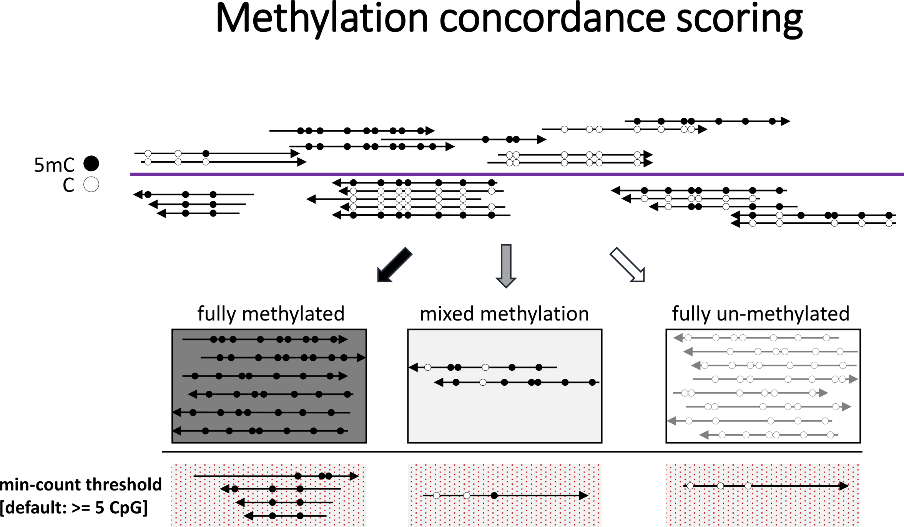

# Concordance across reads

Methylation is typically thought to be laid down in longer stretches rather than appearing sporadically at individual cytosines. As a consequence, several CpGs within a given read are often found either completely methylated or completely unmethylated. A mixed methylation pattern may be used to assess the concordance of the methylation signal, which could be a proxy of the fidelity of maintenance methylation etc.

The script `methylation_consistency` takes in a BAM file generated by Bismark and splits it into three smaller BAM files, based on the consistency/concordance of the methylation calls within the file. The reads are split into those which show consistent methylation, un-methylation and mixed methylation, and only methylation in CpG context is considered. In its default condition, reads are considered as:

```
unmethylated  0 -  10% methylated (inclusive)
mixed:       10 -  90% methylated
methylated:  90 - 100% methylated (inclusive)
```



A consistency report looks roughly like this:

```
Total paired-end records     -  478498
-------------------------------------------------
All methylated    [ >= 90% ] -  10304 (2.15%)
All unmethylated  [ <= 10% ] -  31806 (6.65%)
Mixed methylation [ 10-90% ] -  30176 (6.31%)
Too few CpGs   [min-count 5] -  406212 (84.89%)
```

By default, only reads with 5 or more CpGs are taken into consideration (this can be changed via the flag `--min-count`). The thresholds for un-methylated, mixed methylated, and methylated can be set with `--lower_threshold [percentage]` and `--upper_threshold [percentage]`. `methylation_consistency` works for both single-end and paired-end Bismark BAM files, which are auto-detected by default. For paired-end files, all CpGs of both R1 and R2 are taken into account. Overlap detection/exclusion can take place afterwards at the methylation extraction stage, if desired.
