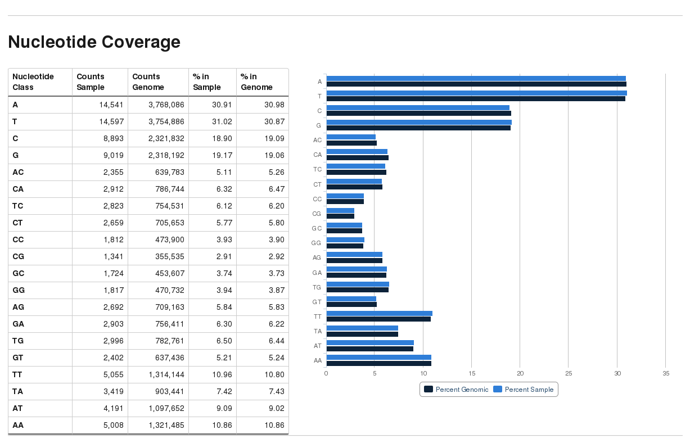

# Nucleotide coverage report

The script `bam2nuc` reads BAM files and calculates the mono- and di-nucleotide coverage of the
reads (using the genomic sequence rather than the observed sequence in the reads themselves)
and compares it to the average genomic sequence composition. Reads harbouring InDels are not
taken into consideration. Mono- or dinucleotides containing Ns are ignored as well.

## Usage

```
bam2nuc [options] --genome_folder <path> [input.(bam|cram)]
```

### Arguments

Aligned BAM files. `bam2nuc` handles both Bismark single-end and paired-end files (determined automatically).

!!! note

    Both BAM and CRAM files should work as input, but please note that Samtools version 1.2 or higher is required for CRAM files.

### Options

- `--dir`

Output directory. Output is written to the current directory if not specified explicitly.

- `--genome_folder <path>`

Enter the genome folder you wish to use to extract sequences from (full path only). Accepted formats are FastA files ending with `.fa` or `.fasta`. Specifying a genome folder path is mandatory.

- `--samtools_path`

The path to your Samtools installation, e.g. `/home/user/samtools/`. Does not need to be specified explicitly if Samtools is in the `PATH` already

- `--genomic_composition_only`

Only calculate and extract the genomic sequence composition and exit thereafter.

This option will attempt to write the genomic composition table `genomic_nucleotide_frequencies.txt` to the genome folder or to the output directory instead if that doesn't succeed.

- `--help`

Displays this help message and exits

## Genomic composition

Since the calculation of the average genomic (di-)nucleotide composition may take a while, `bam2nuc` attempts to write out a file called 'genomic_nucleotide_frequencies.txt' to the genome folder if it wasn't there already. The next time `bam2nuc` is run it will then use this file instead of calculating the average genome composition again. If writing to the genome folder fails (e.g. because of permission issues) it will be written out to the output directory instead.

## Output format

`bam2nuc` writes out a file ending in `.nucleotide_stats.txt` in the following format (tab-delimited):

```tsv title="sample.nucleotide_stats.txt"
(di-)nucleotide count sample    percent sample  count genomic   percent genomic coverage
A       14541   30.91   3768086 30.98   0.004
C       8893    18.90   2321832 19.09   0.004
G       9019    19.17   2318192 19.06   0.004
T       14597   31.02   3754886 30.87   0.004
AA      5008    10.86   1321485 10.86   0.004
AC      2355    5.11    639783  5.26    0.004
AG      2692    5.84    709163  5.83    0.004
AT      4191    9.09    1097652 9.02    0.004
CA      2912    6.32    786744  6.47    0.004
CC      1812    3.93    473900  3.90    0.004
CG      1341    2.91    355535  2.92    0.004
CT      2659    5.77    705653  5.80    0.004
GA      2903    6.30    756411  6.22    0.004
GC      1724    3.74    453607  3.73    0.004
GG      1817    3.94    470732  3.87    0.004
GT      2402    5.21    637436  5.24    0.004
TA      3419    7.42    903441  7.43    0.004
TC      2823    6.12    754531  6.20    0.004
TG      2996    6.50    782761  6.44    0.004
TT      5055    10.96   1314144 10.80   0.004
```

This file is picked up and plotted by `bismark2report` automatically if found in the folder in the following manner:


