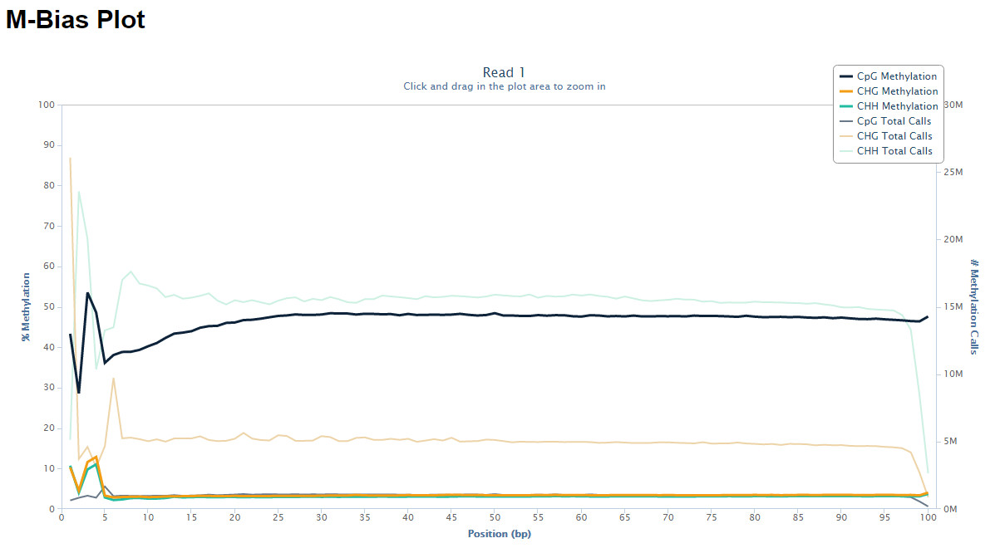
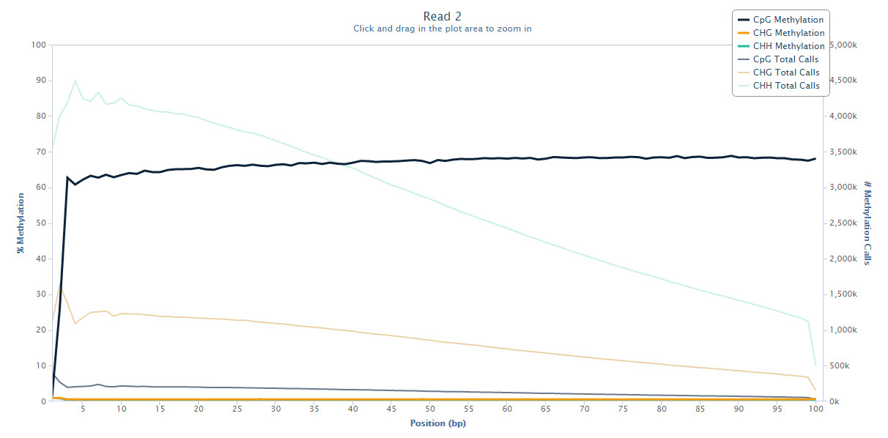

# Methylation extraction

Bismark comes with a supplementary `bismark_methylation_extractor` script which operates on Bismark result files and extracts the methylation call for every single C analysed. The position of every single C will be written out to a new output file, depending on its context (CpG, CHG or CHH), whereby methylated Cs will be labelled as forward reads (+), non-methylated Cs as reverse reads (-). The resulting files can be imported into a genome viewer such as SeqMonk (using the generic text import filter) and the analysis of methylation data can commence. Alternatively, the output of the methylation extractor can be transformed into a `bedGraph` and `coverage` file using the option `--bedGraph` (see also `--counts`). This step can also be accomplished from the methylation extractor output using the stand-alone script `bismark2bedGraph` (also part of the Bismark package available for download at [bioinformatics.babraham.ac.uk](http://www.bioinformatics.babraham.ac.uk/projects/bismark/)). The `coverage` file can also be imported into SeqMonk directly using `Import Data > Bismark (cov)`. Optionally, the bedGraph counts output can be used to generate a genome-wide cytosine report which reports the number on every single CpG (optionally every single cytosine) in the genome, irrespective of whether it was covered by any reads or not. As this type of report is informative for cytosines on both strands the output may be fairly large (~46mn CpG positions or >1.2bn total cytosine positions in the human genome...). The bedGraph to genome-wide cytosine report conversion can also be run individually using the stand- alone module `coverage2cytosine` (also part of the Bismark package available for download at [bioinformatics.babraham.ac.uk](http://www.bioinformatics.babraham.ac.uk/projects/bismark/)).

As of Bismark version 0.6 or higher the default input format for the `bismark_methylation_extractor` is BAM/SAM (or potentially CRAM if you’ve got Samtools 1.2+ installed).

### The methylation extractor output looks like this (tab separated):

1. seq-ID
2. methylation state
3. chromosome
4. start position _(= end position)_
5. methylation call

Methylated cytosines receive a `+` orientation, unmethylated cytosines receive a `-` orientation.

Examples for cytosines in CpG context:

```
HWUSI-EAS611_0006:3:1:1058:15806#0/1 - 6 91793279 z
HWUSI-EAS611_0006:3:1:1058:17564#0/1 + 8 122855484 Z
```

Examples for cytosines in CHG context:

```
HWUSI-EAS611_0006:3:1:1054:1405#0/1 - 7 89920171 x
HWUSI-EAS611_0006:3:1:1054:1405#0/1 + 7 89920172 X
```

Examples for cytosines in CHH context:

```
HWUSI-EAS611_0006:3:1:1054:1405#0/1 - 7 89920184 h
```

The `bismark_methylation_extractor` comes with a few options, such as ignoring the first <int> number of positions in the methylation call string, e.g. to remove a restriction enzyme site (if RRBS is performed with non-directional BS-Seq libraries it might be required to remove reconstituted MspI sites at the beginning of each read as they will introduce a bias into the first methylation call). Another useful option for paired-end reads is called `--no_overlap` (on by default): specifying this option will extract the methylation calls of overlapping parts in the middle of paired-end reads only once (using the calls from the first read which is presumably the one with a lowest error rate).

For a full list of options type: `bismark_methylation_extractor --help` on the command line or refer to the Appendix section at the end of this User Guide.

### Methylation extractor output

By default, the `bismark_methylation_extractor` discriminates between cytosines in CpG, CHG or CHH context. If desired, CHG and CHH contexts can be merged into a single non-CpG context by specifying the option `--merge_non_CpG` (as a word of warning, this might produce files with up to several hundred million lines...).

### Strand-specific methylation output files (default):

As its default option, the `bismark_methylation_extractor` will produce a strand-specific output which will use the following abbreviations in the output file name to indicate the strand the alignment came from:

    OT    –  original top strand
    CTOT  –  complementary to original top strand
    OB    –  original bottom strand
    CTOB  –  complementary to original bottom strand

Methylation calls from OT and CTOT will be informative for cytosine methylation positions on the original top strand, calls from OB and CTOB will be informative for cytosine methylation positions on the original bottom strand. Please note that specifying the `--directional` (the default mode) option in the Bismark alignment step will not report any alignments to the CTOT or CTOB strands.

As cytosines can exist in any of three different sequence contexts (CpG, CHG or CHH) the `bismark_methylation_extractor` default output will consist of 12 individual output files per input file (`CpG_OT_...`, `CpG_CTOT_...`, `CpG_OB_...` etc.).

### Context-dependent methylation output files (`--comprehensive` option):

If strand-specific methylation is not of interest, all available methylation information can be pooled into a single context-dependent file (information from any of the four strands will be pooled). This will default to three output files (CpG-context, CHG-context and CHH-context), or result in 2 output files (CpG-context and Non-CpG-context) if `--merge_non_CpG` was selected (note that this can result in enormous file sizes for the non-CpG output).

Both strand-specific and context-dependent options can be combined with the `--merge_non_CpG` option.

### Optional bedGraph output

The Bismark methylation extractor can optionally also output a file in [`bedGraph`](http://genome.ucsc.edu/goldenPath/help/bedgraph.html) format which uses 0-based genomic start and 1- based end coordinates. The module `bismark2bedGraph` (part of the Bismark package) may also be run individually. It will be sorted by chromosomal coordinates and looks like this:

```
<chromosome> <start position> <end position> <methylation percentage>
```

As the methylation percentage is _per se_ not informative of the actual read coverage of detected methylated or unmethylated reads at a position, `bismark2bedGraph` also writes out a coverage file (using 1-based genomic genomic coordinates) that features two additional columns:

```
<chromosome> <start position> <end position> <methylation percentage> <count methylated> <count unmethylated>
```

These two additional columns enable basically any downstream processing from the file. By default, this mode will only consider cytosines in CpG context, but it can be extended to cytosines in any sequence context by using the option `--CX` (cf. Appendix (III)).

### (Optional): genome-wide cytosine report output

Starting from the `coverage` output, the Bismark methylation extractor can optionally also output a genome-wide cytosine methylation report. The module `coverage2cytosine` (part of the Bismark package) may also be run individually. It is also sorted by chromosomal coordinates but also contains the sequence context and is in the following format:

```
<chromosome> <position> <strand> <count methylated> <count unmethylated> <C-context> <trinucleotide context>
```

The main difference to the `bedGraph` or `coverage` output is that **every** cytosine on both the top and bottom strands will be considered irrespective of whether they were actually covered by any reads in the experiment or not. For this to work one has to also specify the genome that was used for the `Bismark` alignments using the option `--genome_folder <path>`. As for the `bedGraph` mode, this will only consider cytosines in CpG context by default but can be extended to cytosines in any sequence context by using the option `--CX` (cf. Appendix (III)). Be aware though that this might mean an output with individual lines for more than 1.1 billion cytosines for any large mammalian genome...

#### GpC methylation assessment: Context-specific methylation summary report

Every time `coverage2cyyosine` is run, the counts for each cytosine context are recorded and printed to a special file called `*.cytosine_context_summary.txt` for each input coverage file. 

The report ([introduced here](https://github.com/FelixKrueger/Bismark/issues/321)) looks at 2 bp downstream, as well as 1 bp upstream of the cytosine taking part in the methylation call. This is useful for looking at methylation in specific contexts (e.g. `CpA` only), and also when using `GpC` methylases that introduce methylation in `GpC` context. The report looks like this: 


```
upstream	C-context	full context	count methylated	count unmethylated	percent methylation
A	CAA	ACAA	308398	93360	23.24
C	CAA	CCAA	329555	75518	18.64
G	CAA	GCAA	242262	118175	32.79
T	CAA	TCAA	302209	86219	22.20
A	CAC	ACAC	266786	91121	25.46
C	CAC	CCAC	409749	89154	17.87
...
```


#### (Optional): NOMe-seq or scNMT-seq

The `coverage2cytosine` module can be instructed that a sample is a NOMe-seq ([**N**ucleosome **O**ccupancy and **Me**thylome sequencing](https://genome.cshlp.org/content/22/12/2497.long)) or scNMT-seq ([**s**ingle-**c**ell **N**ucleosome, **M**ethylation and **T**ranscription sequencing](https://www.nature.com/articles/s41467-018-03149-4)) sample, where accessible DNA gets methylated in a GpC context (sets option `--gc` as well). The option `--nome-seq`:

```
 (i) filters the genome-wide CpG-report to only output cytosines in ACG and TCG context
(ii) filters the GC context output to only report cytosines in GCA, GCC and GCT context
```

Both of these measures aim to reduce unwanted biases, i.e. the influence of `G-CG` (intended) and `C-CG` (off-target) on endogenous CpG methylation, and the influence of CpG methylation on (the NOMe-seq specific) `GC` context methylation. **PLEASE NOTE** that NOMe-seq data requires a `.cov.gz` file as input which has been generated in non-CG mode!! (`--CX`), else the `GpC` output file will be empty...

### M-bias plot

Starting with Bismark v0.8.0, the Bismark methylation extractor also produces a methylation bias plot which shows the methylation proportion across each possible position in the read (described in further detail in: [Hansen et al., Genome Biology, 2012, 13:R83](https://genomebiology.biomedcentral.com/articles/10.1186/gb-2012-13-10-r83)). The data for the M-bias plot is also written into a coverage text file (ending in `.cov` or `.cov.gz`) and is in the following format:

```
<read position> <count methylated> <count unmethylated> <% methylation> <total coverage>
```

This allows generating nice graphs by alternative means, e.g. using R or Excel. The plot is also drawn into a .png file which requires the Perl module GD::Graph (more specifically, both modules GD::Graph::lines and GD::Graph::colour are required); if GD::Graph cannot be found on the system, only the table will be printed. The plot also contains the absolute number of methylation calls (both methylated and unmethylated) per position. For paired-end reads two individual M-bias plots will be drawn.

The M-bias plot can for example show the methylation bias at the start of reads in PBAT-Seq experiments:



For more on this topic please also see [this post on QCFail.com](https://sequencing.qcfail.com/articles/mispriming-in-pbat-libraries-causes-methylation-bias-and-poor-mapping-efficiencies/).

Or it can reveal a 3’-end-repair bias at the first couple of positions in read 2 of paired-end reads, like here:



For more on this topic please also see [this post on QCFail.com](https://sequencing.qcfail.com/articles/library-end-repair-reaction-introduces-methylation-biases-in-paired-end-pe-bisulfite-seq-applications/).

The M-bias plot should enable researchers to make an informed decision whether or not to leave the bias in the final data or to remove it (e.g. using the methylation extractor option `--ignore`).

### (III) Running `bismark_methylation_extractor`

**USAGE:** `bismark_methylation_extractor [options] <filenames>`

A typical command for a single-end file could look like this:

```
bismark_methylation_extractor --gzip sample_bismark_bt2.bam
```

A typical command for a paired-end file could look like this:

```
bismark_methylation_extractor --gzip sample_bismark_bt2_pe.bam
```

The methylation extractor can also auto-detect the alignment mode and will set the options above automatically. A typical command including the optional `bedGraph` output could look like this:

```
bismark_methylation_extractor --gzip --bedGraph --buffer_size 10G sample_bismark_bt2.bam
```

A typical command including the optional genome-wide cytosine methylation report could look like this:

```
bismark_methylation_extractor --gzip --bedGraph --buffer_size 10G --cytosine_report --genome_folder /path_to_genome_folder/ sample_bismark_bt2.bam
```
