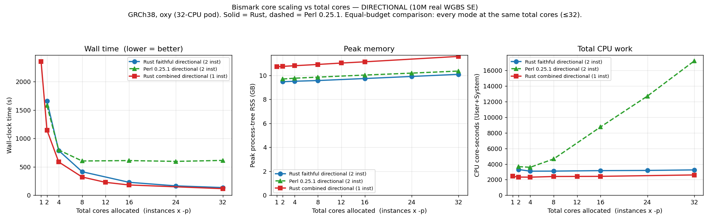
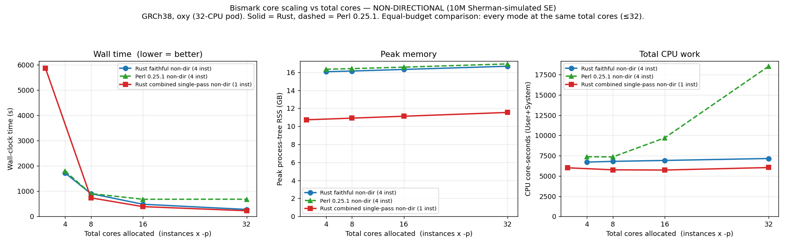

The [Bismark Rust suite](/Bismark/installation/#bismark-rust-suite-beta) reimplements the Bismark
tools in Rust. Its output is byte-identical to Perl Bismark `v0.25.1`, so the two implementations can
be compared on runtime and memory alone.

This page covers a rough default-mode comparison with Perl, how the aligner scales with the number of
cores it is given, and how the post-alignment tools that take a worker count scale with it. Some of
those sweeps are still being filled in; see [Not yet measured](#not-yet-measured).

## Methods

Measurements were taken on a single-tenant Linux x86_64 server (a 32-CPU allocation for the scaling
runs, 256 GB RAM). The Perl baseline is Bismark `v0.25.1` run with `LC_ALL=C`. The same input was
given to both implementations, and outputs were compared after decompression
(`cmp <(zcat a) <(zcat b)`) to confirm byte-identity before timing. Wall-clock time, CPU
utilisation, and peak resident memory were recorded; the aligner runs use a process-tree memory
sampler (wrapper plus all `bowtie2-align` children), which over-counts memory-mapped index pages
shared between processes and so is an upper bound. The server is a shared node, so wall times carry
some load-dependent noise. Treat all figures as indicative rather than averaged.

## A rough comparison in default mode

For orientation, not a claim that the Rust version is faster at everything; for several tools the
goal was only byte-identical output, and timing is incidental.

| Tool | Rust vs Perl | Workload |
|---|---|---|
| `bismark` aligner | 2.6× (directional) / 1.4× (non-directional) faster | 10M WGBS reads, byte-identical |
| `bismark_methylation_extractor` | ~4.8× (matched cores) — up to ~46× vs Perl's single-threaded default | full WGBS, 64.6M read pairs |
| `coverage2cytosine` | ~12× (CpG report) / ~2.6× (`--CX`) | full hg38 |
| `bismark2bedGraph` | ~3.4× (CpG) / ~4.4× (`--CX`) | WGBS PE |
| `NOMe_filtering` | ~3.4× | 10M SE |
| `deduplicate_bismark`, `bam2nuc`, `filter_non_conversion`, `methylation_consistency`, `bismark2report`, `bismark2summary`, `bismark_genome_preparation` | byte-identical; not separately timed | — |

## Aligner

The aligner accounts for most of a run's wall time. It calls the same external Bowtie 2 / HISAT2 /
minimap2 binaries as the Perl version, so the mapping itself is unchanged, but Bismark also does a
large amount of per-read work *around* the mapper — in-silico bisulfite conversion of every read and
methylation-call tagging of every alignment. That wrapper is where the Rust port is faster.

On 10M reads (GRCh38, Bowtie 2 2.5.5, fixed 16-core budget), the faithful Rust aligner is byte-identical
to Perl and:

| Mode | Perl wall | Rust wall | Speedup | Perl CPU | Rust CPU |
|---|---|---|---|---|---|
| Directional | 604 s | 229 s | 2.64× | 8601 core-s | 3145 core-s |
| Non-directional | 665 s | 477 s | 1.39× | 9408 core-s | 6910 core-s |

### Scaling with cores

The plots below show wall time, CPU and peak memory against the total number of cores given to the
aligner (instances × Bowtie 2 `-p`; the leftmost point of each curve is the single-threaded default
that a user gets with no threading flags). Bowtie 2 `-p` only parallelises alignment, not the
per-read wrapper work, which is why the two implementations behave differently as cores are added.

At one thread the two are comparable (both are alignment-bound: directional 1581 s Perl vs 1656 s
Rust). As cores are added the curves separate. **Perl saturates at about 16 cores** — wall time stops
falling while CPU cost keeps climbing (to roughly 17,000–18,000 core-seconds at 32 cores), because the
extra Bowtie 2 threads finish quickly and then wait on the serial Perl wrapper. The Rust wrapper is
cheap, so giving the aligner more cores continues to reduce wall time up to the full 32-core
allocation. At 32 cores the directional run is 613 s (Perl) versus 135 s (faithful Rust). In practice
this means `-p` (more cores) is a useful lever for the Rust aligner, whereas Perl needs `--multicore`
to use more than about 16 cores.

### Combined-index modes

The aligner also offers an opt-in [combined-index mode](/Bismark/usage/alignment/) that builds one
index holding both the C→T and G→A genomes instead of separate per-strand instances. For
non-directional data this is the fastest mode at every core budget and uses about **32 % less peak
memory** (one ~11.5 GB index instead of four per-strand instances totalling ~16.7 GB). It is
concordance-gated rather than byte-identical: against the faithful result, about 0.1 % of reads
change fate, almost all unique↔ambiguous flips at cross-sub-genome ties, with actual mis-placement
around 0.005 %.

The aligner's `--multicore` / `--parallel` model is also worker-invariant: the output does not depend
on the number of workers.

## Methylation extractor

Perl's methylation extractor is single-threaded by default. On 64.6M read pairs (WGBS, gzip output)
it takes **4583 s — about 76 minutes**. The Rust extractor uses roughly 7 cores for parallel gzip
even at its default `--parallel 1`, and finishes the same job in about **99 s**: ~46× faster out of
the box. Against Perl's fastest parallel setting (`--multicore 12`, which drives ~19 cores) it is
about 4.8× faster at comparable resourcing.

| Run | Cores used | Wall |
|---|---|---|
| Perl `v0.25.1`, default (single-threaded) | ~1 | 4583 s (~76 min) |
| Perl `v0.25.1`, `--multicore 12` | ~19 | 479 s |
| Rust, default (`--parallel 1`) | ~7 | ~99 s |

So the speedup a user actually sees depends on how Perl was being run: dramatic against Perl's
single-threaded default, and a steadier ~4.8× against a heavily-multicored Perl.

### Scaling with `--parallel`

`--parallel` sweep in gzip-output mode, same WGBS data, three repetitions per point:

| `--parallel` | Wall (s) | CPU (cores) | Peak threads |
|---|---|---|---|
| 1 | ~99 | ~7.1 | 67 |
| 2 | ~101 | ~7.0 | 67 |
| 4 | ~100 | ~7.1 | 69 |
| 8 | ~98 | ~7.2 | 73 |
| 16 | ~95 | ~7.3 | 81 |

In gzip mode the extractor is limited by BAM decompression, which already keeps about 7 cores busy, so
raising `--parallel` barely changes wall time or CPU use; it mainly adds worker threads. Peak memory
stayed below ~0.7 GB across the sweep. (In uncompressed output mode the picture differs: CPU use is
much lower and memory grows with worker count.) Single-end and RRBS sweeps, plotted on the same axes
as the aligner graphs, are [still to come](#not-yet-measured).

## rammap (experimental)

`--rammap` adds a fourth backend, [`rammap`](https://github.com/jwanglab/rammap), a pure-Rust
reimplementation of minimap2 for long-read alignment (for example EM-seq Nanopore data). It is opt-in
and concordance-gated, and is not byte-identical to minimap2; it is a separate experimental track from
the faithful port.

On 1M EM-seq Nanopore reads (GRCh38, through the Bismark wrapper), rammap and minimap2 agree on the
fate of 98.3 % of reads, with unique-versus-ambiguous classification differing for 0.011 % of reads,
and on 99.8 % of per-CpG methylation calls at depth ≥ 1.

Run in-process (`--rammap_inprocess`, available from `2.0.0-beta.11`) rather than as a subprocess, the
converted index is loaded once and shared across the strand instances, which makes it both faster and
lighter. On 1M non-directional reads:

| Metric | Subprocess `--rammap` | In-process `--rammap_inprocess` |
|---|---|---|
| Wall time | 2451 s | 1382 s (~1.8× faster) |
| Peak memory | 70.9 GB | 32.3 GB (−54 %) |

The in-process backend is worker-invariant and scales 11.4× from one thread to sixteen while peak
memory stays flat at ~31 GB, since all threads share one in-memory index. Plain `--rammap` still runs
the subprocess.

## Profiling the Perl pipeline

For context, the rewrite was prioritised from a profile of a complete Perl `v0.25.1` run (Apple M1
Pro, 55.7M paired-end reads, GRCh38):

| Stage | Perl wall time | Share of total |
|---|---|---|
| Alignment (Bowtie 2) | 472 min | 74 % |
| Methylation extraction | 104 min | 16 % |
| bedGraph + coverage report | 57 min | 9 % |
| Deduplication | 8.7 min | 1 % |

## Not yet measured

The following sweeps are planned on 10M-read subsets and will be added as plots matching the aligner
graphs above:

- `--parallel` sweeps for the **methylation extractor** on single-end and RRBS data (alongside the
  WGBS PE data above) and for the **deduplicator**, recording wall time, CPU use and peak memory.
- A fuller `--multicore` sweep for the **rammap in-process backend** beyond the two points above.

The methodology and raw logs for the figures here are kept with each tool in the repository.
