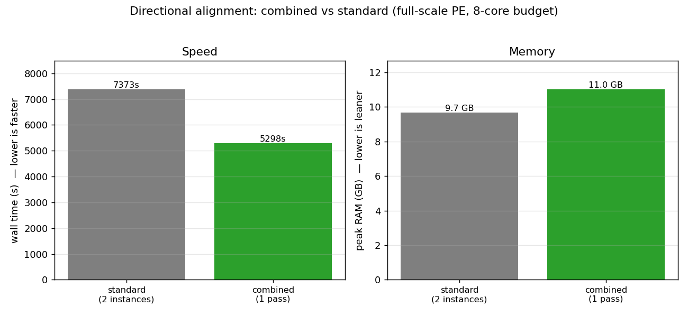
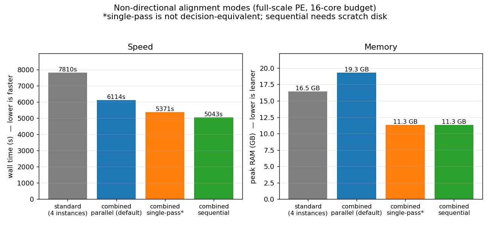

The Rust `bismark` aligner can run several ways. The faithful default reproduces Perl `v0.25.1`
byte-for-byte; the opt-in **combined index** is usually faster and can be lighter, at the cost of being
*concordance-gated* rather than byte-identical. This page is a short decision guide — the numbers behind
it are on the [Benchmarks](/Bismark/rust/benchmarks/) page, and each flag is described under
[Alignment](/Bismark/usage/alignment/).

All combined modes need a one-time combined index:

```bash
bismark prepare --combined_genome /path/to/genome/
```

and they scale with Bowtie 2 threads (`-p`), not `--multicore` (which is rejected in combined mode).

## Quick guide

Pick your library row, then your priority:

| Library | ⚡ Fastest / least CPU | 🔒 Byte-identical to Perl | 💽 Memory- or disk-constrained |
|---|---|---|---|
| **Directional** | `--combined_index` (one pass, tune `-p`) | standard, 2 instances | combined is already light (+~1.3 GB, no spill) |
| **Non-directional** | `--combined_index_sequential` — fastest **and** leanest RAM | standard, 4 instances | **low RAM + have disk** → sequential · **low disk** → `--combined_index_single_pass`† or `--combined_index` (parallel) |
| **PBAT** | `--combined_index` (one pass, tune `-p`) | standard, 2 instances | combined is already light |

† `--combined_index_single_pass` is *not* decision-equivalent — see [Correctness](#correctness--concordance).

## Directional and PBAT

For directional and PBAT libraries the combined index is a clean win: one both-strands pass replaces the
two per-strand instances, so it is faster at every core budget and uses about 22–28 % less CPU, for a
*fixed* ~1.3 GB memory premium that does not grow with read count.



If you need output **byte-identical to Perl `v0.25.1`**, use the standard per-strand index (omit
`--combined_index`).

## Non-directional

Non-directional has the most choices, because the combined index can run its two both-strands passes
three ways. They differ sharply on memory and disk:



- **`--combined_index_sequential` — recommended.** Runs the two passes one at a time, so it is the
  **fastest** *and* uses the **least RAM** (~11 GB), and it is **byte-identical to the parallel combined
  run**. Its one cost is a small BGZF-compressed scratch spill (see the note below).
- **`--combined_index_single_pass`** — just as fast and light, with **no disk spill**, but **not
  decision-equivalent** (a read-name tag perturbs Bowtie 2's RNG, so ~1 read in 10,000 is placed
  differently but equally validly). Use it when disk is tight and that tiny non-equivalence is acceptable.
- **`--combined_index` (parallel — the current default)** — no disk spill, but keeps two combined indexes
  resident (~19 GB) and is the slowest combined mode. Use it when you have neither spare disk nor a reason
  to prefer the others.
- **standard (4 instances)** — the only **byte-identical-to-Perl** non-directional option.

:::note[`--combined_index_sequential` uses a small BGZF-compressed scratch spill]
Sequential spills its first pass to a temporary file in `--temp_dir`, then replays it against the second
pass. The spill is **BGZF-compressed — about 0.09 KB per read pair**, roughly **7× smaller than the raw
SAM**, so even the largest paired-end runs stay modest: on the order of **~95 GB for ~1 billion pairs**.
Any filesystem with that much fast scratch is fine — just point `--temp_dir` at it. If scratch is
genuinely tight, `--combined_index_single_pass` (no spill) and the standard index remain spill-free
alternatives.
:::

## Correctness / concordance

The combined index is **opt-in and never silent**; it trades exact reproduction for speed:

- **Byte-identical to Perl `v0.25.1`** → only the **standard** per-strand modes.
- **Concordance-gated** (benign ~0.01–0.04 % churn versus the faithful result, almost all
  unique↔ambiguous flips at cross-sub-genome ties) → `--combined_index` (parallel) **and**
  `--combined_index_sequential`, which are byte-identical *to each other*.
- **Not decision-equivalent** (the above, plus a tiny RNG-perturbed reassignment) →
  `--combined_index_single_pass`.

If your pipeline requires bit-for-bit reproduction of Perl Bismark output, stay on the standard index.
For everything else, the combined index is the faster choice.
