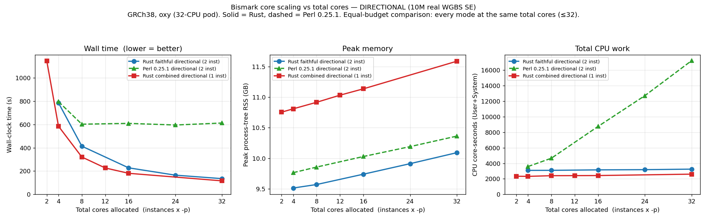
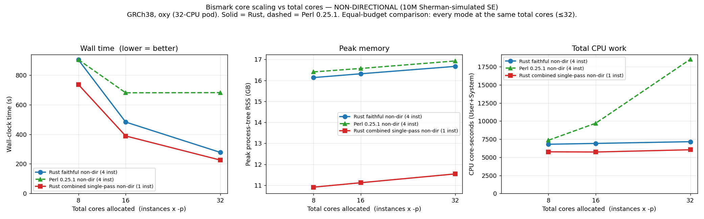

# Core-scaling results — Bismark aligner: time · CPU · RAM vs total cores

> Companion to [`BENCHMARK_RESULTS_alignment_modes.md`](BENCHMARK_RESULTS_alignment_modes.md).
> How Rust vs Perl 0.25.1 alignment modes scale with the cores you give them, on a **32-CPU** budget.
> **Run:** 2026-06-09 on oxy (`dockyard-oxy-0`, **32-CPU pod allocation**), `bismark_rs 2.0.0-beta.1` (shipped `0b6bb8b`),
> Bowtie 2 2.5.5, GRCh38, 10M SE reads. Slug `plans/06092026_bismark-beta/`. Feeds [[project_full_beta_nfcore_announcement]].

## Axis & method (read first)
- **x = total cores allocated = (Bowtie 2 instances) × `-p`.** Directional faithful/Perl use **2** instances, non-dir faithful/Perl use **4**, the combined modes use **1**. So "total cores", not `-p`, is the fair variable — at the same `-p` the modes would use wildly different core counts.
- Everything is **capped at 32 cores** (the pod's CPU allocation); no point oversubscribes. Modes line up at the shared **8 / 16 / 32-core** budgets → a fair equal-budget comparison.
- Per cell: wall (`SECONDS`), CPU core-seconds (`/usr/bin/time -v` User+System), peak **process-tree** RSS (descendant-PID sampler), max concurrent `bowtie2-align*`. No concordance (correctness already gate-proven; this is pure perf).

## Graphs
**Directional** (10M real WGBS SE) — `faithful_dir` vs `perl_dir` vs `comb_dir`:

**Non-directional** (10M Sherman-simulated SE, 64 bp, gzipped) — `faithful_nondir` vs `perl_nondir` vs `comb1pass`:

## Headline findings

### 1. Perl's `-p` saturates; the Rust port keeps scaling
Adding cores past ~16 does **nothing** for Perl wall time, in *both* library types, while its CPU cost balloons:

| Directional, wall (s) @ total cores | 4 | 8 | 16 | 24 | 32 |
|---|--:|--:|--:|--:|--:|
| Perl 0.25.1 | 797 | 603 | 610 | 596 | **613** ← flat |
| Rust faithful | 787 | 414 | 228 | 165 | **135** |
| Rust combined | (586@4) | 321 | 181 | 227@12 | **116** |

| Perl directional CPU core-s | 3586 | 4657 | 8759 | 12719 | **17229** |
|---|--:|--:|--:|--:|--:|

`★` Bowtie 2 `-p` only parallelises *alignment*; Bismark's per-read wrapper work (in-silico bisulfite conversion, methylation tagging) is serial. In **Perl** that wrapper is the bottleneck, so extra Bowtie 2 threads finish faster then **spin idle** (CPU core-s explodes, wall flat) — which is exactly why Perl needs **`--multicore`** to use more cores. In **Rust** the wrapper is cheap (~3.1k core-s, flat), so plain `-p`/more-cores keeps paying off to the full 32-core budget. **Answer to "is `-p` enough / is `--parallel` still needed":** for the Rust port `-p` (more cores) is a genuine lever up to your allocation; for Perl it saturates at ~16 cores and you need `--multicore`.

### 2. The combined modes are the fastest at every budget — fewer instances use cores better
At equal total cores, **one** Bowtie 2 instance scales better than 2–4 instances splitting the same cores:

| @ 32 cores | wall (s) | CPU core-s | peak RSS | indices |
|---|--:|--:|--:|--:|
| **Directional** | | | | |
| Perl 0.25.1 | 613 | 17229 | 10.36 GB | 2 |
| Rust faithful | 135 | 3251 | 10.09 GB | 2 |
| **Rust combined (comb_dir)** | **116** | **2605** | 11.59 GB | **1** |
| **Non-directional** | | | | |
| Perl 0.25.1 | 682 | 18542 | 16.93 GB | 4 |
| Rust faithful | 278 | 7156 | 16.67 GB | 4 |
| **Rust combined single-pass (comb1pass)** | **226** | **6040** | **11.54 GB** | **1** |

- **Directional:** combined is ~5.3× faster than Perl and even edges out faithful (116 vs 135s) with the **least CPU** (one combined-index search replaces two per-strand ones). It costs ~1.5 GB more RAM (1 fat index vs 2 thin).
- **Non-directional:** combined single-pass is fastest (3.0× Perl, 1.2× faithful), uses the **least CPU** *despite* aligning 20M conversion-tagged reads (one combined-index search beats four per-strand instances), **and** cuts peak RAM **~32%** (one ~11.5 GB index vs four totalling ~16.7 GB). This is where the single-pass memory trick legitimately pays off.

### 3. RAM is index-dominated and flat in cores
Peak RSS barely moves with core count (the loaded index dominates; per-thread buffers add ~1–1.5 GB across the sweep). The level is set by index *layout*: 1 combined index (~11–12 GB) vs 2 directional (~10 GB) vs 4 non-dir (~16–17 GB). The combined single-pass's single index is the non-directional RAM win.

## Scaling efficiency (wall, total-core span)
| mode | span (cores) | speedup | 
|---|---|--:|
| Rust faithful directional | 4→32 (8×) | 5.8× |
| Rust combined directional | 4→32 (8×) | 5.1× (9.9× over 2→32) |
| Perl directional | 4→32 (8×) | **1.3× (plateau)** |
| Rust faithful non-dir | 8→32 (4×) | 3.3× |
| Rust combined single-pass | 8→32 (4×) | 3.3× |
| Perl non-dir | 8→32 (4×) | **1.3× (plateau)** |

## Caveats & method notes
- **32-CPU pod cap.** 4-instance non-dir modes max at `-p 8` (= 32 cores); 2-instance at `-p 16`; 1-instance at `-p 32`. All cells ≤ 32 cores — earlier `-p 12/16` non-dir runs (48/64 cores) were oversubscribed and discarded.
- **Non-dir reads are Sherman-simulated** (10M, 64 bp, 0% error, 100% conversion — clean reads, ideal for a scaling curve; gzipped to match the real directional set's input format). The earlier mistake of running `comb1pass` (a non-directional, read-doubling mode) on the *directional* set — where half its work is wasted — has been dropped; the directional combined curve is now `comb_dir` (`--combined_index`, no tagging, 10M reads).
- Summed process-tree RSS over-counts shared mmap'd index pages (an upper bound); ratios and single-index figures are sound.
- Shared K8s node: co-tenant load adds (unavoidable, prior-gate-consistent) wall noise.

## Reproduce / artifacts
- Harnesses: `run_scaling_rust.sh <reads> <tag> <mode>` (modes: faithful_dir, comb_dir, faithful_nondir, comb1pass; `PS_LIST` env overrides the `-p` set), `run_scaling_perl.sh <reads> <tag> {perl_dir,perl_nondir}`; orchestrated by `master_remaining.sh` + `master2_capped.sh`.
- Plot: `MPLCONFIGDIR=<tmp> python3 plot_scaling.py scaling_all_total_cores.tsv <out_dir>` → `directional.png` + `nondir.png`.
- Raw merged data: `scaling_all_total_cores.tsv` (25 cells; captured off-box from oxy `~/v2spike_out/bench_align_modes/`).
