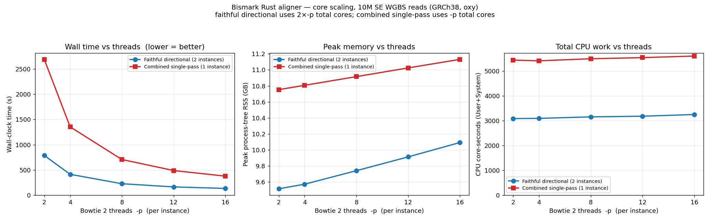

# Core-scaling results — Bismark Rust aligner (time · CPU · RAM vs threads)

> Companion to [`BENCHMARK_RESULTS_alignment_modes.md`](BENCHMARK_RESULTS_alignment_modes.md).
> How two Rust alignment **execution strategies** scale with Bowtie 2 threads (`-p`).
> **Run:** 2026-06-09 on oxy (`dockyard-oxy-0`, shared K8s node), `bismark_rs 2.0.0-beta.1` (shipped `0b6bb8b`),
> Bowtie 2 2.5.5, GRCh38, **10,000,000 real WGBS SE reads**. Slug `plans/06092026_bismark-beta/`. Feeds [[project_full_beta_nfcore_announcement]].

## ⚠️ Read first — the two series are different library types / workloads
This is **not** a like-for-like race; it's each mode's **intrinsic thread-scaling**. The x-axis is `-p` (threads *per Bowtie 2 instance*):

| Series | Library | Bowtie 2 instances | Reads aligned | Total cores at `-p` |
|---|---|---|---|---|
| **faithful_dir** | directional | **2** (CT + GA, concurrent) | 10M (2 strands) | **2 × p** |
| **comb1pass** | non-directional, single-pass (model b) | **1** | **20M** (conversion-tagged interleaved, 2× base) | **p** |

So at the same x (`-p`), **faithful uses 2× the total cores** *and* **combined aligns 2× the reads** (the interleaved CT/GA-tagged set). Compare each curve to *itself* across threads; cross-mode gaps reflect those structural differences, not efficiency.

## Graphs

## Data (10 cells, all exit 0)

| Mode | `-p` | Total cores | Wall (s) | CPU core-s | Peak RSS (GB) | Idx loads |
|------|----:|----:|----:|----:|----:|----:|
| faithful_dir | 2 | 4 | 787 | 3087.2 | 9.51 | 2 |
| faithful_dir | 4 | 8 | 414 | 3095.4 | 9.57 | 2 |
| faithful_dir | 8 | 16 | 228 | 3155.9 | 9.74 | 2 |
| faithful_dir | 12 | 24 | 165 | 3182.0 | 9.91 | 2 |
| faithful_dir | 16 | 32 | 135 | 3251.0 | 10.09 | 2 |
| comb1pass | 2 | 2 | 2688 | 5442.4 | 10.75 | 1 |
| comb1pass | 4 | 4 | 1352 | 5412.4 | 10.81 | 1 |
| comb1pass | 8 | 8 | 707 | 5496.1 | 10.91 | 1 |
| comb1pass | 12 | 12 | 489 | 5541.4 | 11.02 | 1 |
| comb1pass | 16 | 16 | 378 | 5604.6 | 11.13 | 1 |

## Analysis

### Wall time — both scale strongly; the single instance scales *better*
| | p2 | p16 | speedup (p2→p16, 8× threads) | parallel efficiency |
|---|---:|---:|---:|---:|
| faithful_dir | 787 s | 135 s | **5.83×** | 73 % |
| comb1pass | 2688 s | 378 s | **7.11×** | **89 %** |

Combined single-pass (one Bowtie 2 instance) scales closer to linear (89 %) than faithful directional (73 %). Faithful runs **two** instances that share the box and a wrapper with some serial sections, so its returns flatten earlier (most of its gain is already in by `-p 8`: 787→228 = 3.4× over the first 4× of threads, then only 228→135 = 1.7× over the next 4×). Both show the usual diminishing returns past ~8 threads.

### Peak RAM — index-dominated, ~flat in threads; 1 index vs 2
RSS barely moves with `-p` (the loaded Bowtie 2 index dominates; per-thread buffers add only ~0.4–0.6 GB across the whole sweep). The level difference is the index story:
- **comb1pass holds ONE combined index** (~10.8–11.1 GB).
- **faithful_dir holds TWO per-strand indices** (~9.5–10.1 GB).

Here the single fat combined index is ~1 GB *more* than two thin directional indices (it contains both genomes). The combined-index RAM **win** appears against *non-directional* faithful (4 indices, ~16.3 GB) — see the companion results doc; it's out of this directional-vs-single-pass sweep.

### CPU core-seconds — constant work per mode; the gap is workload, not waste
Total CPU work is **near-constant across thread counts** within each mode (faithful ~3.09–3.25k; combined ~5.41–5.60k) — adding threads spreads the same work, with only a few-percent rise from thread-coordination overhead. The **~1.78× gap** between the modes is exactly the workload: comb1pass aligns **20M** conversion-tagged reads (non-directional) vs faithful's **10M** (directional). It is *not* combined-mode inefficiency.

## Takeaways
1. **Both Rust modes parallelise well**; the single-instance combined single-pass scales more efficiently (89 % vs 73 % over p2→p16) — fewer instances contending, cleaner thread utilisation.
2. **RAM is set by index layout, not threads**: 1 combined index (~11 GB) vs 2 directional indices (~10 GB). The headline combined RAM win is vs the 4-instance *non-directional* faithful (16.3 GB), not the directional baseline here.
3. **Total CPU work is flat in threads**; the combined/faithful CPU gap is the 2× tagged-read (non-directional) workload.
4. Practical: give a single combined single-pass run as many threads as you have (it keeps paying off to 16); for faithful directional, returns flatten past ~`-p 8` per instance (~16 total cores).

## Reproduce / artifacts
- Harness: `run_bench_core_scaling.sh <reads> <tag>` (sweeps `-p {2,4,8,12,16}` for both modes; tree-RSS sampler; no concordance — perf only).
- Plot: `MPLCONFIGDIR=<tmp> python3 plot_scaling.py scaling_summary.tsv scaling` → `scaling.png`.
- Raw: `full10M_scaling_summary.tsv`, `full10M_scaling.log` (captured off-box from oxy `~/v2spike_out/bench_align_modes/full10M_scaling/`).
- Shared K8s node caveat (node load from co-tenants) applies as in the companion doc.
